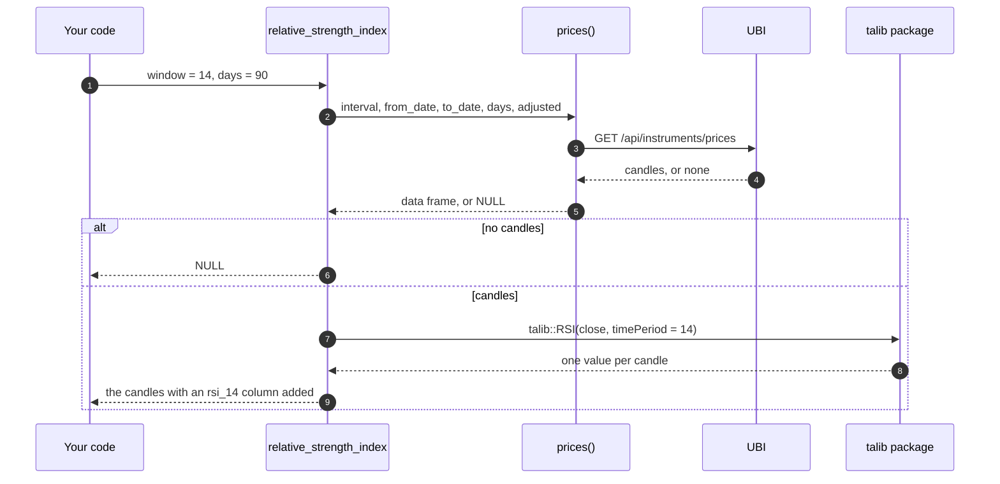

# Analysis

Every instrument object can analyse its own price history. A share, an
index or a commodity future has 209 analysis methods: moving averages,
oscillators, candlestick pattern detectors, summary statistics,
crossover signals, a backtest runner and performance measures such as
the Sharpe ratio. You call one on the instrument, such as
`reliance$relative_strength_index(window = 14, days = 90)`, and it
fetches the candles from UBI, runs the calculation and hands back the
candles with the result added as a new column.

The methods are not written on `Instrument` itself. They live in
fourteen small R6 classes, one per group of related calculations, in the
files `R/assets_analysis_*.R`. Because an R6 class can have only one
parent, the fourteen form one chain, each inheriting the one before it,
from `PriceAnalysis` at the root to `PerformanceMeasures` at the end,
and `Instrument` inherits the last link, so it has every method in the
chain. Most of the calculations come from [TA-Lib](https://ta-lib.org/),
a widely used C library of technical indicators, through the R `talib`
package, and follow its function groups; the statistics, the signals,
the backtest and the performance measures are this package’s own. Every
[asset
basket](https://pramodathani.github.io/tradeR/articles/guide-asset-baskets.md)
inherits the same chain, because `AssetBasket` inherits
`PerformanceMeasures` too and supplies `prices()` of its own.

## How a method works

Every analysis method that works on candles follows the same four steps,
which the sequence diagram below traces for `relative_strength_index()`.



Three things follow from this design, and each is worth knowing before
you call the methods in a loop.

1.  **Each call fetches its own candles.** Two indicators on the same
    instrument send two requests. That is deliberate: UBI runs on the
    same machine and keeps its own copy of the candles in Redis, so a
    repeated request is cheap, and the package keeps no cache of its
    own.
2.  **No candles means `NULL`, not an error.** When UBI has no candles
    for the range, `prices()` returns `NULL`, and so does every method
    built on it. That is what happens for every instrument in a family
    UBI stores no candles for, as the [table
    below](#which-instruments-have-candles) shows.
3.  **The early rows are empty.** An indicator needs a run of candles
    before it has a value, so the first rows of its column are `NA`. A
    14-candle RSI has nothing for its first 14 rows, and the Hilbert
    transform indicators need 32 to 63 candles before their first value.
    Ask for a longer range than the window you want to look at.

## The common arguments

Every method that fetches candles takes the same five arguments as
[`prices()`](https://pramodathani.github.io/tradeR/reference/Instrument.html#method-Instrument-prices),
after its own. The table below lists them. Give either `days`, or
`from_date` and `to_date`, but not both.

| Name | Type | Default | Description |
|----|----|----|----|
| `interval` | character | `"day"` | The candle length, such as `"day"` or `"5minute"` |
| `from_date` | `Date` or character | `NULL` | The first day of the range, as a date or `"YYYY-MM-DD"` |
| `to_date` | `Date` or character | `NULL` | The last day of the range |
| `days` | integer | `NULL` | The number of days to count back from today |
| `adjusted` | logical | `TRUE` | Whether prices are adjusted for splits and bonuses, for the segments UBI adjusts |

Each method’s own arguments use the package’s spelled-out names rather
than TA-Lib’s. The window length is `window`, not TA-Lib’s `timeperiod`
or the `talib` package’s `timePeriod`, and not `period`, and the candle
column to work on is `column`, which defaults to `"close"`.

**The window argument is `window`.**

Passing a name the method does not have fails in R before any request is
sent. For `reliance$simple_moving_average(period = 5)`, R stops with the
error `unused argument (period = 5)`.

The correct call is
`reliance$simple_moving_average(window = 5, days = 90)`.

## The fourteen classes

The table below lists the fourteen analysis classes in the order of the
chain, from the one just after `PriceAnalysis` to the one `Instrument`
inherits, with the number of public methods in each. The counts add up
to 209, the same as in the Python library. The thirteen older classes
add up to 192, and `PerformanceMeasures` was added to the Python library
as the fourteenth on 2026-09-28.

| Class | File | Methods | What it holds | Each method returns | Article |
|----|----|---:|----|----|----|
| [`PriceStatistics`](https://pramodathani.github.io/tradeR/reference/PriceStatistics.md) | `R/assets_analysis_price_statistics.R` | 39 | Highs, lows, means, spreads and quantiles of prices, volumes and returns | A number, a summary, a histogram or a narrowed data frame | [Statistics](https://pramodathani.github.io/tradeR/articles/analysis-statistics.html#price-statistics) |
| [`OverlapStudies`](https://pramodathani.github.io/tradeR/reference/OverlapStudies.md) | `R/assets_analysis_overlap_studies.R` | 12 | Moving averages, Bollinger bands, parabolic SAR | The candles with columns added | [Indicators](https://pramodathani.github.io/tradeR/articles/analysis-indicators.html#overlap-studies) |
| [`MomentumIndicators`](https://pramodathani.github.io/tradeR/reference/MomentumIndicators.md) | `R/assets_analysis_momentum_indicators.R` | 28 | MACD, RSI, ADX, stochastics and other oscillators | The candles with columns added | [Indicators](https://pramodathani.github.io/tradeR/articles/analysis-indicators.html#momentum-indicators) |
| [`VolumeIndicators`](https://pramodathani.github.io/tradeR/reference/VolumeIndicators.md) | `R/assets_analysis_volume_indicators.R` | 3 | Chaikin accumulation distribution, on balance volume | The candles with a column added | [Indicators](https://pramodathani.github.io/tradeR/articles/analysis-indicators.html#volume-indicators) |
| [`CycleIndicators`](https://pramodathani.github.io/tradeR/reference/CycleIndicators.md) | `R/assets_analysis_cycle_indicators.R` | 6 | The Hilbert transform family | The candles with columns added | [Indicators](https://pramodathani.github.io/tradeR/articles/analysis-indicators.html#cycle-indicators) |
| [`PriceTransforms`](https://pramodathani.github.io/tradeR/reference/PriceTransforms.md) | `R/assets_analysis_price_transforms.R` | 4 | Average, median and typical price, weighted close | The candles with a column added | [Statistics](https://pramodathani.github.io/tradeR/articles/analysis-statistics.html#price-transforms) |
| [`VolatilityIndicators`](https://pramodathani.github.io/tradeR/reference/VolatilityIndicators.md) | `R/assets_analysis_volatility_indicators.R` | 3 | True range and average true range | The candles with a column added | [Indicators](https://pramodathani.github.io/tradeR/articles/analysis-indicators.html#volatility-indicators) |
| [`StatisticFunctions`](https://pramodathani.github.io/tradeR/reference/StatisticFunctions.md) | `R/assets_analysis_statistic_functions.R` | 8 | Beta, correlation, linear regression, standard deviation | The candles with columns added | [Statistics](https://pramodathani.github.io/tradeR/articles/analysis-statistics.html#statistic-functions) |
| [`MathTransforms`](https://pramodathani.github.io/tradeR/reference/MathTransforms.md) | `R/assets_analysis_math_transforms.R` | 15 | Trigonometric, logarithmic and rounding functions | The candles with a column added | [Statistics](https://pramodathani.github.io/tradeR/articles/analysis-statistics.html#math-transforms) |
| [`MathOperators`](https://pramodathani.github.io/tradeR/reference/MathOperators.md) | `R/assets_analysis_math_operators.R` | 10 | Adding, dividing, rolling highs and lows | The candles with columns added | [Statistics](https://pramodathani.github.io/tradeR/articles/analysis-statistics.html#math-operators) |
| [`CandlestickPatterns`](https://pramodathani.github.io/tradeR/reference/CandlestickPatterns.md) | `R/assets_analysis_candlestick_patterns.R` | 61 | TA-Lib’s candlestick pattern recognisers | The candles with a column of 100, -100 or 0 | [Patterns](https://pramodathani.github.io/tradeR/articles/analysis-patterns.md) |
| [`Signals`](https://pramodathani.github.io/tradeR/reference/Signals.md) | `R/assets_analysis_signals.R` | 2 | Crossovers and crossunders between two columns | A copy of your data frame with a logical column | [Signals and backtests](https://pramodathani.github.io/tradeR/articles/analysis-signals-and-backtests.html#signals) |
| [`StrategyBacktests`](https://pramodathani.github.io/tradeR/reference/StrategyBacktests.md) | `R/assets_analysis_strategy_backtests.R` | 1 | A backtest of a strategy built on `BacktestStrategy` | A named list of statistics | [Signals and backtests](https://pramodathani.github.io/tradeR/articles/analysis-signals-and-backtests.html#backtests) |
| [`PerformanceMeasures`](https://pramodathani.github.io/tradeR/reference/PerformanceMeasures.md) | `R/assets_analysis_performance_measures.R` | 17 | Returns, volatility, Sharpe, Sortino and Calmar ratios, drawdowns, value at risk and measures against a benchmark | A number, a data frame of drawdowns or a named list summary | [Performance measures](https://pramodathani.github.io/tradeR/articles/analysis-performance.md) |

The chain starts at a small base class,
[`PriceAnalysis`](https://pramodathani.github.io/tradeR/reference/PriceAnalysis.md),
which declares `prices()` and signals an error from it, the R stand-in
for Python’s `NotImplementedError`. That lets each analysis file be
written and read on its own, without the instrument classes.
`Instrument` and `AssetBasket` supply the real `prices()`, which reads
UBI.

The chart below shows the same counts, coloured by what calculates each
class’s methods in R. Candlestick patterns and price statistics make up
almost half of the total. The math transforms and math operators are
written in base R because the `talib` package lacks most of them, and
`MomentumIndicators` and `StatisticFunctions` mix the two, as
[Indicators](https://pramodathani.github.io/tradeR/articles/analysis-indicators.md)
and [Statistics and
transforms](https://pramodathani.github.io/tradeR/articles/analysis-statistics.md)
explain.


A bar chart of the number of public methods in each of the fourteen
analysis classes, coloured by what calculates them: the talib package,
base R, both, or this package’s backtesting engine.

## Which instruments have candles

An analysis method can only work where UBI stores candles, and it stores
them for a minority of segments. The table below lists what is known,
family by family. [Asset
classes](https://pramodathani.github.io/tradeR/articles/asset-classes.md)
has the full matrix.

| Family | Classes with candles | Classes without |
|----|----|----|
| [Equities](https://pramodathani.github.io/tradeR/articles/asset-classes-equities.md) | `Equity` (adjusted, with `price_factor`), `EquityIndex` | The four derivative classes have not been checked |
| [Fixed income](https://pramodathani.github.io/tradeR/articles/asset-classes-fixed-income.md) | none | all six |
| [Commodities](https://pramodathani.github.io/tradeR/articles/asset-classes-commodities.md) | the four derivative classes | `Commodity`, `CommodityIndex` |
| [Currencies](https://pramodathani.github.io/tradeR/articles/asset-classes-currencies.md) | none | all six |
| [Funds and trusts](https://pramodathani.github.io/tradeR/articles/asset-classes-funds.md) | `ExchangeTradedFund` (adjusted, with `price_factor`) | `InvestmentTrust` |
| [Mutual funds](https://pramodathani.github.io/tradeR/articles/asset-classes-mutual-funds.md) | none | `MutualFund` |

UBI’s daily job loads only `day` candles. Intraday intervals such as
`5minute` are loaded into UBI by hand, so an intraday call usually
returns `NULL` unless someone has loaded that instrument; on 2026-09-26,
the Python library’s `prices(interval="5minute", days=1)` on RELIANCE
returned nothing. UBI’s page on [price
history](https://pramodathani.github.io/unified_broker_interface/pipelines/price-history/)
explains what is loaded and from which broker.

## A first example

The example below adds a 20-day simple moving average to RELIANCE’s
candles and marks the days its close crossed above it. It was not run
for this article, because it needs a live UBI; the calls are taken from
the method signatures.

``` r

reliance <- Equity$new(exchange = "nse", symbol = "RELIANCE")

frame <- reliance$simple_moving_average(window = 20, days = 365)
crossings <- reliance$is_cross_over(frame, "close", "sma_20")
columns <- c(
  "datetime",
  "close",
  "sma_20"
)
print(crossings[crossings$cross_over, columns])
```

The first call returns the candles with an `sma_20` column. The second
marks, in a new `cross_over` column, each row where the close was at or
below the average on the previous row and above it on this one.

## The articles in this section

Each article lists every method in its groups, with the method’s own
arguments and the column it adds. The list below says what each one
covers.

- **[Indicators](https://pramodathani.github.io/tradeR/articles/analysis-indicators.md)**
  covers overlap studies, momentum, volume, volatility and cycle
  indicators, 52 methods.
- **[Candlestick
  patterns](https://pramodathani.github.io/tradeR/articles/analysis-patterns.md)**
  covers the 61 pattern recognisers and what their 100, -100 and 0
  values mean.
- **[Statistics and
  transforms](https://pramodathani.github.io/tradeR/articles/analysis-statistics.md)**
  covers price statistics, statistic functions, math operators and
  transforms, and price transforms, 76 methods.
- **[Signals and
  backtests](https://pramodathani.github.io/tradeR/articles/analysis-signals-and-backtests.md)**
  covers crossover detection and running a strategy over an instrument’s
  candles with the package’s backtesting engine.
- **[Performance
  measures](https://pramodathani.github.io/tradeR/articles/analysis-performance.md)**
  covers returns, risk, drawdowns and comparison with a benchmark, 17
  methods.
