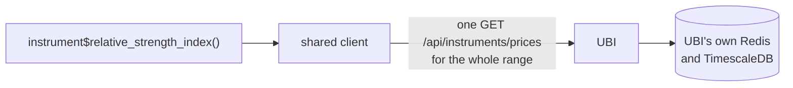
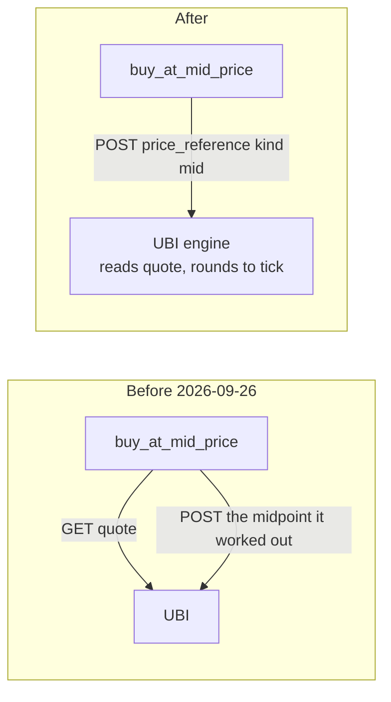
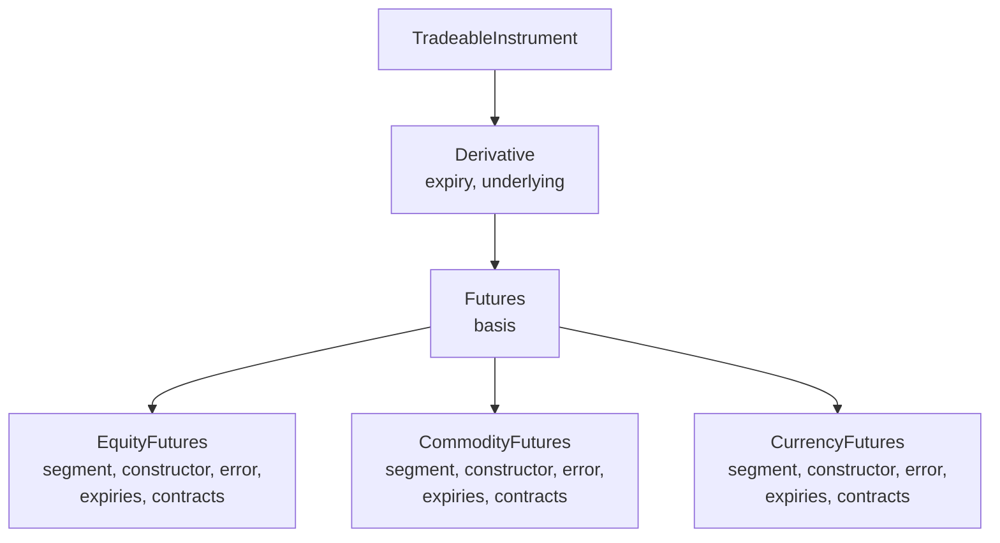

# Design choices

This article records the decisions that shape the package. Each record
says what problem the decision solves, what was chosen, why, and what it
costs, and it names the files where you can see the decision in the
code. Most of them come down to one idea: UBI already holds the rules
and the data, so this package should pass requests through to it rather
than keep a second copy that could drift.

The package is a native R port of the Python library `tradingmachine`,
so the records come in two groups. The first twelve were made for the
Python library, and the R port kept every one of them; where the R form
differs, the record says how. The records after them are choices the R
port made itself, which the sidecar notes under `.claude/notes/R/`
describe in more detail.

## The decisions at a glance

The table below lists every record in this article with its main benefit
and its main cost.

| Decision | What it buys | What it costs |
|----|----|----|
| [Value members are active bindings](#value-members-are-active-bindings) | Code reads as what a value means, `share$last_price` | Each read is a request, with no brackets to warn you |
| [No caching or date-range batching around UBI](#no-caching-or-date-range-batching-around-ubi) | A value is never stale, and there is no cache to invalidate | Repeated reads repeat requests |
| [No local tick or lot validation](#no-local-tick-or-lot-validation) | One source of truth for exchange rules | A bad price is found by a round trip, not before it |
| [Plain strings rather than enums](#plain-strings-rather-than-enums) | No second list of allowed values to keep in step | A typo is caught by UBI, not by your editor |
| [Row lists become data frames](#row-lists-become-data-frames) | Orders, trades and candles filter and sort directly | “No rows” is `NULL` rather than an empty data frame |
| [Order types are built in UBI, not here](#order-types-are-built-in-ubi-not-here) | One implementation of each order type | Every order depends on UBI’s order engine running, and a plain limit order is held there rather than sent |
| [One self-contained class per case](#one-self-contained-class-per-case) | Each class can be read, fixed and changed alone | The same code is repeated across classes, except where the derivative bases hold it once |
| [A derivative is given its underlying, or finds it in a fixed order](#a-derivative-is-given-its-underlying-or-finds-it-in-a-fixed-order) | Nearly every contract has a priced underlying with no extra argument | Only a given object is free; the rest are looked up on every read |
| [Greeks are computed here, with Black-76 or Black-Scholes](#greeks-are-computed-here-with-black-76-or-black-scholes) | Implied volatility and greeks without a UBI route | A slightly different model from UBI’s engine |
| [Discovery reads the master rather than search](#discovery-reads-the-master-rather-than-search) | Live contracts are always found | A whole segment is downloaded on each call |
| [Baskets are stored here and linked to instruments](#baskets-are-stored-here-and-linked-to-instruments) | Index and fund contents that UBI does not keep, analysed like an instrument | The contents are only as current as the last import |
| [Inherited methods are linked, not repeated, in the reference](#inherited-methods-are-linked-not-repeated-in-the-reference) | Reference pages of a usable size | A family class’s page links to the analysis methods rather than showing them |
| [Every class is an R6 class](#every-class-is-an-r6-class) | Objects that behave like Python’s, with the same names and the same calls | A dependency on the `R6` package |
| [The analysis classes form one chain](#the-analysis-classes-form-one-chain) | Every analysis method on every instrument and basket, with single inheritance | Private method names must be unique along the whole chain |
| [Class methods become functions on the class generator](#class-methods-become-functions-on-the-class-generator) | The Python calls, such as `Equity$search()`, keep their shape | Each family class writes its functions out, because generators do not inherit them |
| [Errors are conditions with the Python class hierarchy](#errors-are-conditions-with-the-python-class-hierarchy) | [`tryCatch()`](https://rdrr.io/r/base/conditions.html) handlers catch a family of errors, as Python’s `except` does | A table of parent classes to keep in step with the Python modules |
| [Indicators come from the talib package, with gaps filled in base R](#indicators-come-from-the-talib-package-with-gaps-filled-in-base-r) | The same TA-Lib calculations as Python, matched to the last bit or within 1e-9 | 29 functions written in base R, and one known difference in a rare case |
| [Backtests run on a native R engine](#backtests-run-on-a-native-r-engine) | The same trades and statistics as backtesting.py, with no Python | Eight classes to maintain, renamed strategy hooks, and a plainer plot |
| [Base R instead of the tidyverse](#base-r-instead-of-the-tidyverse) | Code a one-year R user can follow, with few dependencies | Some pandas behaviour had to be written out by hand |
| [The shared client lives in the package environment](#the-shared-client-lives-in-the-package-environment) | One client per session that survives `devtools::load_all()` | One R-only function to install a client by hand |

## Value members are active bindings

**The problem.** Some members of an instrument only report a value, such
as the last price or the open orders, while others take arguments or act
on the market. Until 2026-09-22 the Python library’s rule was that
anything fetched over HTTP was a method, because Google style guide rule
2.13 allows a property only for a cheap computation. That left half the
live values as properties and half as methods, and the split followed
how a value was fetched rather than what it meant.

**The choice.** Any member that only reports a value is a Python
`@property`, and in R an active binding, which is read without brackets
and signals an error when assigned to. A member is a method only when it
takes an argument, such as `prices(interval, days)`, or when it writes
to the market, such as `place_order()` or `cancel_open_orders()`. The
user decided this on 2026-09-22. When a method with an optional filter
became a property, the filter was dropped: `orders(status = None)`
became the `orders` property, and a caller who wants one status filters
the `status` column.

**Why.** The caller should read what a member means. `share$last_price`
is the share’s last price, and the fact that it comes over HTTP from a
service on the same machine is a detail. UBI answers from its own Redis,
so the cost argument was weaker than it looked, and the members that
report what the account owns, such as `net_positions`, were already
properties.

**The cost.** A loop that reads the same active binding twice sends two
requests, and there are no brackets to hint at it. Code that needs a
value more than once assigns it to a local variable.

**In the code.** `R/assets_instruments.R`, where `quote`, `last_price`,
`ohlc`, the eleven order-book values, the order and trade readers and
the position readers are all active bindings, and `R/assets_equities.R`
for the holdings readers.

## No caching or date-range batching around UBI

**The problem.** The old tradingmachine project cached candles in Redis
for five minutes and quotes for five seconds, kept the cache warm with a
poller, and split long date ranges into batches. Each indicator method
fetches its own candles, so the same candles can be fetched many times.

**The choice.** Every call goes straight to UBI. There is no cache, in
Redis or in memory, no poller and no batching of date ranges. The user
decided this on 2026-09-14.

**Why.** UBI runs on the same machine and already caches in its own
Redis, and its `/prices` route serves any date range in one request. A
second cache here would add a second place for a value to go stale, and
a stale expiry list or quote is a worse failure than a slow one.

**The cost.** Repeated reads repeat requests. Asking a derivative class
for its expiries and then for a chain downloads the segment master
twice, about four seconds for single-stock options. The members that
need two values from one moment, `bid_offer_spread` and `mid_price`,
read both from a single quote so that they never mix two moments. If the
cost ever matters, the answer is a measurement first, not a cache added
in advance.

**In the code.** `R/assets_instruments.R`, whose class documentation
says every call goes straight to UBI’s REST API. The reasoning is under
“No caching and no batching” in the Python library’s note
`.claude/notes/src/tradingmachine/assets/instruments.py.md`.

## No local tick or lot validation

**The problem.** An order whose price is not a multiple of the tick
size, or whose quantity is not a whole number of lots, will be refused.
The package could check this before sending, or round the price itself.

**The choice.** Prices and quantities are sent exactly as the caller
gave them, with no tick rounding, no lot-multiple check and no expiry
check. The user chose this on 2026-09-20 over both raising an error
locally and rounding silently.

**Why.** UBI and the broker behind it hold the authoritative rules, and
UBI reports `lot_size` and `tick_size` as missing whenever its brokers
disagree, so a local check would sometimes have nothing to check
against. A refusal from the broker is the correct and informative
failure. Where a price is worked out rather than given, UBI now rounds
it to the tick itself, towards the passive side.

**The cost.** A malformed order costs a round trip to be refused,
instead of failing before it leaves your R session. On commodities in
particular, `quantity = 1` on an MCX gold future is refused with HTTP
400, because the quantity is counted in quotation units and one lot is
100.

**In the code.** `TradeableInstrument$place_order()` in
`R/assets_instruments.R`, whose documentation says the values are sent
exactly as given, and `SyntheticOrder` in `R/orders_synthetic_order.R`,
which validates nothing before sending.

## Plain strings rather than enums

**The problem.** Orders use a fixed vocabulary: `buy` or `sell`,
`market` or `limit`, `cnc`, `mis` or `nrml`. It could be wrapped in
named constants or a factor of allowed values.

**The choice.** Vocabulary that UBI already validates is passed as plain
character strings, such as `"buy"`, `"limit"` and `"mis"`. The same
holds for `exchange`, `segment`, `option_type` and the candle
`interval`. The user confirmed this on 2026-09-20.

**Why.** UBI rejects an unknown value with a clear message. A local list
of allowed values would be a second list that has to be kept in step
with UBI’s, and it would drift the first time UBI added a value.

**The cost.** A typo is caught by UBI at run time rather than by your
editor. The
[Vocabulary](https://pramodathani.github.io/tradeR/articles/guide-vocabulary.md)
article lists every accepted string.

**In the code.** Package constants are still used for values this
package itself chooses and reuses, such as
`INSTRUMENTS_INDEX_SEGMENT_SUFFIX` in `R/assets_instruments.R` and the
segment names such as `EQUITIES_EQUITY_SEGMENT` in
`R/assets_equities.R`. The rule is about mirroring UBI’s vocabulary, not
about avoiding constants.

## Row lists become data frames

**The problem.** Several UBI routes return many rows of the same shape:
candles, the order book, the trade book, positions, the instrument
master. They could be returned as lists of named lists.

**The choice.** A member that wraps such a route returns a base R
`data.frame`, where the Python library returns a `pandas.DataFrame`. A
member that returns a single record, such as one holding, returns a
named list, where Python returns a `dict`. When UBI has no rows at all,
the member returns `NULL` rather than an empty data frame. The user
chose this for the Python library on 2026-09-20, and the R port keeps
the same columns in the same order.

**Why.** It is consistent with `prices()`, which already built a frame
from UBI’s candles, and a table of orders or trades is far easier to
filter, sort and inspect as a data frame. A one-row data frame would be
awkward to read a single value from, which is why single records stay
named lists.

**The cost.** Callers must check for `NULL` with
[`is.null()`](https://rdrr.io/r/base/NULL.html) before using a data
frame. A nested object inside a row, such as a position’s `pnl`, becomes
a list column, so `frame$pnl[[1]]$realized` reads it.

**In the code.** `prices()`, `orders`, `trades`, `net_positions` and the
other readers in `R/assets_instruments.R`, the discovery functions
`search`, `contracts` and `chain` on each family class, and
`FrameBuilder` in `R/utilities_frame_builder.R`, which turns UBI’s rows
into a data frame and back.

## Order types are built in UBI, not here

**The problem.** Until 2026-09-26 the Python library’s price wrappers
read the order book themselves, worked out a price and sent it, and the
position methods read the position and worked out the side and size. On
2026-09-23 UBI gained an order engine that can do all of this itself,
plus 42 synthetic order types, which grew to 53 on 2026-09-27.

**The choice.** Anything UBI can work out is sent as a description: a
`price_reference`, a `quantity_reference` or a `synthetic` named list.
The user decided this on 2026-09-26, saying that the order types being
created here no longer needed to be, because they had been added in UBI.
The wrappers kept their names and signatures and stopped reading the
book, and the `R/orders_*.R` files hold one thin class per synthetic
type that only describes the order and sends it.

**Why.** Keeping each order type in one place avoids two implementations
that diverge. It also fixed two real faults: the price is now read
immediately before the order is placed rather than one request earlier,
and a midpoint is rounded to the tick instead of landing between ticks
where the exchange refuses it. For the R port the choice paid off again,
because there was no order logic to port, only request bodies.

**The cost.** Every order depends on UBI’s order engine, and when it is
not running UBI refuses the order with HTTP 503. Until UBI removed its
direct placement mode on 2026-09-27, the Python `place_order` also had
to send a dry run before the first such order to prove the engine was in
use. UBI’s engine also makes choices of its own, such as holding a plain
limit order until the book reaches its price, which [Order
engine](https://pramodathani.github.io/tradeR/articles/architecture-order-engine.html#plain-limit-orders-are-held)
describes. An empty or shallow order book comes back as UBI’s HTTP 503,
`ServiceUnavailableError`, and the old local `OrderError` was deleted.

**In the code.** `place_order()` and the wrappers in
`R/assets_instruments.R`, and every `R/orders_*.R` file. When a new
order convenience is wanted, the first question is whether UBI already
offers it; if it does not, it belongs in UBI.

## One self-contained class per case

**The problem.** The six classes of an asset family differ only in a
segment constant, a base class and an error class, and the synthetic
order types differ only in their settings. Each group could be one
parameterised class, or a hierarchy of intermediate bases such as
`Futures` and `Option`.

**The choice.** Each case is its own class, written out in full, with a
shallow base only where the mechanism is genuinely identical. Each
asset-class file is copied from the equities one rather than sharing
code with it, even the roughly 180 lines of holdings logic, and each
synthetic order type is its own class in its own file over a shallow
`SyntheticOrder` base that holds only storing the template, building the
`synthetic` list and sending it.

The derivative classes are the one place where a middle layer was added.
Until 2026-09-28 every family class inherited `TradeableInstrument` or
`NonTradeableInstrument` directly. On that day the user asked for
`Derivative`, `Futures`, `Option`, `IndexFutures` and `IndexOption`,
which hold what every contract shares, and the sixteen futures and
option classes now inherit them. Each family class still keeps its own
constructor, error class and documentation, and names its segment in a
package constant such as `EQUITIES_EQUITY_FUTURES_SEGMENT`.

**Why.** A reader can open one file and see everything one kind of
contract does, and a change to one class cannot break another. The user
prefers some duplication over a shared abstraction that every case has
to be read through. The derivative bases pass the same test from the
other side: every contract member, such as days to expiry or the basis,
is the same calculation in every family.

**The cost.** The same code is repeated, so a fix to the holdings logic
has to be made in five classes. Errors are flat siblings under
`InstrumentError`, so there is no single handler for “anything in the
equity family”; catch the contract’s own error, or `InstrumentError` for
any instrument problem. In Python the discovery class methods
`expiries`, `contracts`, `strikes` and `chain` are written once on the
derivative bases. In R they are written out on each family class’s
generator, as [Class methods become functions on the class
generator](#class-methods-become-functions-on-the-class-generator)
explains, but each is a short call into the shared
`InstrumentCatalogue`.

**In the code.** The six family files `R/assets_equities.R`,
`R/assets_fixed_income.R`, `R/assets_commodities.R`,
`R/assets_currencies.R`, `R/assets_funds.R` and
`R/assets_mutual_funds.R`, the five derivative bases at the end of
`R/assets_instruments.R`, `R/assets_exceptions.R`, and the
`R/orders_*.R` files. The mechanism that is truly identical, such as the
discovery helpers, sits on `InstrumentCatalogue`.

## A derivative is given its underlying, or finds it in a fixed order

**The problem.** A future or option is written on something, and most of
its useful figures, such as the basis and the greeks, need that thing’s
price. UBI has no reliable join: only the `underlying_symbol` string
matching an instrument’s `symbol`, and not every underlying carries it.
And for commodities and currencies the thing matched by name is a
reference record with no price.

**The choice.** A contract tries four ways in order. An object given as
`underlying =` when it is built wins. Then UBI’s
`underlying_instrument_id`, resolved in UBI from the brokers’ own
records of each contract’s underlying. Then the family’s default: an
equity’s share or index by symbol, and for an option on a commodity, a
currency pair or a bond the future on the same underlying that expires
first on or after it; a future outside equities has no default. Last,
`UnderlyingError` says plainly that nothing was found. Only a given
object is stored. The user asked for the given object, then for the
whole order, on 2026-09-28.

**Why.** A check of UBI’s database that day counted the 198,122 live
derivatives. Names found 96.1 per cent of underlyings, the brokers’
codes fixed the two real mismatches, `NIFTYFPI` and `SENSEX50`, and 98.9
per cent of options had a future to be priced off. Each way covers what
the one before it misses, and the order puts the most certain first.
Renaming the two mismatched indices in UBI was considered and rejected,
because a new name gives an index a new `instrument_id` and strands its
price history.

**The cost.** Nothing checks a given object against `underlying_symbol`,
so a wrong one gives wrong figures silently. Only a given object is
free; the others send a request or two on every read. UBI has served its
link since 2026-09-28, and holds it for mapping dates from 2026-09-22;
earlier dates have none.

**In the code.** The private methods `look_up_underlying()` and
`nearest_future()` of `Derivative`, and the package constant
`INSTRUMENTS_UNDERLYING_SEGMENT_FOR_DERIVATIVE_SEGMENT`, in
`R/assets_instruments.R`.
[Derivatives](https://pramodathani.github.io/tradeR/articles/guide-derivatives.html#how-a-contract-finds-its-underlying)
documents the order.

## Greeks are computed here, with Black-76 or Black-Scholes

**The problem.** An option trader wants implied volatility and the
greeks, and UBI has no route for either.

**The choice.** `Option$implied_volatility()` and `Option$greeks()` work
them out locally, in `R/assets_option_pricing.R`, from the option’s and
the underlying’s last prices. The user chose this on 2026-09-28. An
option priced off a future uses Black-76, and any other uses
Black-Scholes; the user asked for Black-76 later that day, once options
on commodities, currencies and bonds started defaulting to a future.

**Why.** This is analysis, like the technical indicators, rather than
order behaviour, so it does not cut across the rule that order types
belong in UBI. The maths needs only base R, with
[`stats::pnorm()`](https://rdrr.io/r/stats/Normal.html) for the
cumulative normal distribution where the Python code uses `math.erf`.
The two give the same function, and on 2026-10-07 the R and Python
models agreed to ten decimal places on every price, greek and implied
volatility checked.

**The cost.** An equity option is still priced with Black-Scholes on the
spot, while UBI’s engine uses Black-76 on the forward, so the two can
differ slightly for an index option. Both models assume a European
option without dividends, expiry at 15:30 India time, and a risk-free
rate of 0.065 unless the caller gives one.

**In the code.** `R/assets_option_pricing.R` and the `Option` class in
`R/assets_instruments.R`.

## Discovery reads the master rather than search

**The problem.** To find a contract you do not already know, such as
this week’s NIFTY options, you need UBI’s list of instruments. UBI’s
`/api/instruments/search` route sorts by expiry ascending, caps its
answer at 200 rows and takes no offset. Asked for NIFTY index options on
2026-09-20, it returned 200 rows that all shared an expiry four weeks in
the past.

**The choice.** `search` on a cash or index class uses
`/api/instruments/search`, which ranks exact and prefix matches first
and is right for finding a name. `expiries`, `contracts`, `strikes` and
`chain` on the derivative classes read `/api/instruments/master`, which
streams the whole segment with no cap, and filter it here. Expired
contracts are left out unless `include_expired = TRUE`, and a contract
expiring today, in India time, still counts as live.

The chart below shows how much of each segment the master had to stream
on 2026-09-20, and how long it took.

A bar chart of the rows each segment master streamed on 2026-09-20: 23
for nse_equity_index_futures, 14,826 for nse_equity_index_options and
125,967 for nse_equity_options, taking about 0.0, 0.2 and 1.3 seconds.

**Why.** With search, every live contract in a busy segment sits
permanently behind thousands of expired ones. The master is complete,
and because UBI runs on the same machine even 125,967 rows arrive in
about 1.3 seconds.

**The cost.** Each discovery call downloads its whole segment again,
with no cache. The calls return a data frame of identities rather than
instrument objects, because a 214-contract chain as objects would mean
214 lookups; the caller builds the few contracts it wants.

**In the code.** The methods
[`search()`](https://rdrr.io/r/base/search.html), `master()`,
`contracts_for()`, `expiry_dates()`, `strikes()` and `identity_frame()`
of `InstrumentCatalogue` in `R/assets_instruments.R`, which stand in for
the Python library’s protected class methods on `Instrument`, and the
`search`, `expiries`, `contracts`, `strikes` and `chain` functions on
each family class’s generator. [Finding
instruments](https://pramodathani.github.io/tradeR/articles/guide-discovery.md)
documents the public calls.

## Baskets are stored here and linked to instruments

**The problem.** An index’s constituents and weights and a fund’s
holdings are needed to analyse what the index or fund is made of, and a
portfolio or a watchlist is a group of instruments the caller chooses.
UBI stores none of these: it has no index constituents, no index
weights, no fund holdings and no net asset values. There was also a
choice about the existing index and fund classes, which could have
become baskets themselves.

**The choice.** Baskets live in this project’s MongoDB, in the
`asset_baskets` collection, one document per basket name and
`effective_date`, written by `BasketStore` and filled from a CSV file by
`BasketCsvImporter`. An instrument is linked to its basket rather than
merged with it: the `constituents` active bindings of
`NonTradeableInstrument`, `ExchangeTradedFund` and `MutualFund` return
the stored basket, whose `linked_instrument` is the instrument again,
while the official price stays on the instrument. Both were decided on
2026-09-28, when the Python package was added, and the R port keeps the
same collection and document shape.

**Why.** MongoDB was already configured and already read by the client
for UBI’s credentials, through `pymongo` in Python and `mongolite` in R,
and one basket, a name with a list of members, fits in one document.
Keeping a version per date means a past rebalance can still be read.
Linking rather than merging keeps the instrument classes unchanged, and
a basket reads every member in one list request, because UBI’s `POST`
forms of the instrument routes take a whole list.

**The cost.** A stored basket is only as current as the last import, and
nothing refreshes it yet. `constituents` returns `NULL` until a basket
has been saved for that instrument. A basket has no `save` method of its
own, so callers write `BasketStore$new()$save(basket)`; the Python plan
had one, and it was dropped because the basket would have had to import
the store, which imports every basket class. A basket’s candles are
built from its members, so its high and low are an approximation and its
volume is `NA`.

**In the code.** The `R/asset_baskets_*.R` files, with the reasoning in
`.claude/notes/R/asset_baskets_asset_basket.R.md` and the other basket
notes. [Asset
baskets](https://pramodathani.github.io/tradeR/articles/guide-asset-baskets.md)
documents the classes and [Performance
measures](https://pramodathani.github.io/tradeR/articles/analysis-performance.md)
the measures they share with instruments.

## Inherited methods are linked, not repeated, in the reference

**The problem.** `Instrument` inherits 209 analysis methods, and all 27
family classes inherit from it. A reference that reprinted every
inherited method on every class page would repeat the whole analysis
surface 27 times. The Python library measured this on 2026-09-20 with
mkdocstrings: with `inherited_members: true` its site was 151 MB, took
112 seconds to build, and its largest page, for `fixed_income`, was 23.8
MB, which a browser cannot use. With `inherited_members: false` the site
was 13 MB, built in 5.9 seconds, and its largest page was 1.0 MB.

**The choice.** The Python site sets `inherited_members: false`. The R
reference reaches the same result by the way roxygen2 documents R6
classes: each method is documented once, on the page of the class that
defines it, and a subclass’s page lists its inherited methods only as
links, under a collapsed “Inherited methods” heading. The
[`Equity`](https://pramodathani.github.io/tradeR/reference/Equity.md)
page, for example, links 258 inherited methods, from
`PriceStatistics$price_high()` onwards, without repeating their
documentation.

**Why.** A page that repeats hundreds of methods is too large to read or
load, and nothing is lost except the repetition. A local build of this
site on 2026-10-07 was 29 MB in all, with 203 reference pages; the
`Equity` page was 144 KB, and the largest page, `TradeableInstrument`,
which documents the order and position members itself, was 3.7 MB.

**The cost.** A reader on a family class’s reference page follows a link
to the analysis class to see an inherited method. The hand-written
[Analysis](https://pramodathani.github.io/tradeR/articles/analysis.md)
articles cover them by topic instead.

**In the code.** roxygen2’s R6 support, which `devtools::document()`
runs to write `man/`, and `_pkgdown.yml`, which groups the reference
pages. [Writing these
docs](https://pramodathani.github.io/tradeR/articles/project-writing-docs.md)
has more.

## Every class is an R6 class

**The problem.** The Python library is object-oriented throughout, and R
has several object systems: S3, S4, reference classes and the `R6`
package. The port needed one that could carry Python’s classes with the
same names, the same members and the same calls.

**The choice.** Every class is an R6 class, built with
[`R6::R6Class()`](https://r6.r-lib.org/reference/R6Class.html) and given
the Python class’s name. Instance attributes are public fields,
properties are active bindings that signal an error when assigned to,
methods keep their names and argument order, and a protected method such
as `_cancel_one_parent` becomes the private method `cancel_one_parent`.
`__repr__` becomes a [`format()`](https://rdrr.io/r/base/format.html)
method with a matching [`print()`](https://rdrr.io/r/base/print.html),
and `__eq__` becomes `equals(other)`. The user chose a native port,
rather than calling the Python library through reticulate, on
2026-10-07.

**Why.** R6 gives reference semantics, so an object changed in one place
is changed everywhere, as a Python object is; active bindings, which are
the closest match to properties; and `super$` calls, which the family
classes use to call the base constructor. A Python call then translates
to R by replacing `.` with `$`, as in `infosys$prices(days = 365)`.

**The cost.** The package depends on `R6`. An R6 object is locked once
it is built, so it cannot gain new fields later; that matters only for
the backtesting strategies, whose indicators are declared by name
instead, as [Backtests run on a native R
engine](#backtests-run-on-a-native-r-engine) explains. R6 private
members are visible only to their own object, so where one Python object
read another’s protected method, the R port reads public members
instead; `AssetBasket` does this when it compares two baskets’ weights.

**In the code.** Every file in `R/`, and the mapping table in
`.claude/CLAUDE.md`. The reasons for each dependency are in
`.claude/notes/DESCRIPTION.md`.

## The analysis classes form one chain

**The problem.** The Python `Instrument` inherits fourteen analysis
mixins at once, and `AssetBasket` inherits the same fourteen. R6 allows
a class only one parent.

**The choice.** The fourteen analysis classes form one chain, each
inheriting the one before it: `PriceAnalysis`, then `PriceStatistics`,
`OverlapStudies`, `MomentumIndicators`, `VolumeIndicators`,
`CycleIndicators`, `PriceTransforms`, `VolatilityIndicators`,
`StatisticFunctions`, `MathTransforms`, `MathOperators`,
`CandlestickPatterns`, `Signals`, `StrategyBacktests` and finally
`PerformanceMeasures`. `Instrument` and `AssetBasket` both inherit
`PerformanceMeasures`, so both get every analysis method. [The
instrument
model](https://pramodathani.github.io/tradeR/articles/architecture-instrument-model.html#one-chain-of-analysis-classes)
draws the chain.

**Why.** The analysis methods have distinct names, so a chain gives
exactly the methods the mixins give, in any order. A single chain is
also the simplest structure R6 offers, with no composition objects to
forward calls through.

**The cost.** R6 private members are shared along the whole chain, so a
private method in a later class with the same name as one in an earlier
class would replace it. The private helpers of `PriceStatistics`
therefore carry a `price_statistics_` prefix, and the notes for
`PerformanceMeasures` warn that no other analysis class may define a
private method with one of its helper names. The order of the chain is
fixed by each file’s `inherit =` line, which must stay as it is.

**In the code.** The `inherit =` line of each `R/assets_analysis_*.R`
file, and `.claude/notes/R/assets_instruments.R.md`.

## Class methods become functions on the class generator

**The problem.** Python’s public class methods, such as `Equity.search`
and `EquityOption.chain`, are called on the class rather than on an
object. The protected class methods behind them, such as
`Instrument._search_catalogue`, are shared by every family through
inheritance. An R6 class generator is an environment, and functions
stored on it are not passed on to the generators of subclasses.

**The choice.** A public class method becomes a function stored on the
class generator after the class is defined, such as
`Equity$search <- function(...)`, written out for each class that has
it. The shared protected class methods became the methods of a small
helper class, `InstrumentCatalogue`, which each discovery function
builds and calls. `strikes()` was added to it because `Option.strikes`
was the one discovery method whose body was more than a call. The same
pattern serves `Instrument$shared_unified_broker_interface()`,
`ErrorCatalogue$raise()` and the implied volatility functions on the
option pricing models.

**Why.** The calls keep the shape a Python user expects,
`EquityOption$chain(...)` for `EquityOption.chain(...)`, and the shared
mechanism still lives in one place.

**The cost.** Each family class writes its discovery functions out, five
or so short functions per file. `Futures$expiries()` and the other
functions on the base generators exist only to signal `FuturesError` or
`OptionError`, as calling them on the Python base classes does, because
those classes name no segment.

**In the code.** The end of each family file, such as
`R/assets_equities.R`, and `InstrumentCatalogue` in
`R/assets_instruments.R`.

## Errors are conditions with the Python class hierarchy

**The problem.** The Python library raises its own exception classes,
arranged in a hierarchy, so that `except InstrumentError` catches
`EquityError` and `except UnifiedBrokerInterfaceError` catches
`NotFoundError`. R has no exception classes.

**The choice.** Every error is an R condition whose class vector is the
Python class name followed by every Python parent class, then `error`
and `condition`. `ErrorCatalogue$raise("SomeError", message)` builds and
signals it. [`tryCatch()`](https://rdrr.io/r/base/conditions.html)
matches a handler against any element of the class vector, so
`tryCatch(..., InstrumentError = function(error) ...)` catches
`EquityError` exactly as Python’s `except InstrumentError` does. The
condition carries the fields `message`, `status_code`, `detail` and
`parent`, and `parent` holds the caught condition, the R counterpart of
Python’s `raise ... from error`. Python’s built-in `ValueError`,
`TypeError`, `KeyError` and `NotImplementedError` are in the catalogue
too, so the R documentation can name the same errors the Python
documentation names.

**Why.** Callers can write the same error handling as in Python, by the
same names, and the original UBI failure stays reachable from a family
error.

**The cost.** The hierarchy lives in four tables, one per Python
exceptions module and one for the built-in exceptions. They were
generated from the Python files on 2026-10-07, and a new error class
needs one line in the right table.

**In the code.** `R/utilities_error_catalogue.R`,
`R/unified_broker_interface_exceptions.R`, `R/assets_exceptions.R` and
`R/asset_baskets_exceptions.R`, with the reasoning in
`.claude/notes/R/utilities_error_catalogue.R.md`.

## Indicators come from the talib package, with gaps filled in base R

**The problem.** The Python library’s indicators, patterns and rolling
statistics call 150 functions of the TA-Lib C library through Python’s
`talib` package, which links TA-Lib C 0.6.4. The R port needed the same
numbers.

**The choice.** The CRAN package `talib` (version 0.9.4), published on
2026-10-05, wraps the same C library and covers 121 of those 150
functions. The other 29 are written in base R, following TA-Lib’s C
definitions: the arithmetic and rolling operators of `MathOperators`,
the fifteen math transforms, the rate of change in `rate_of_change()`
and `rate_of_change_percent()`, and the linear regression lines. Three
that the `talib` package does have were replaced too, because it bundles
a newer TA-Lib, C 0.8.1, whose versions differ from 0.6.4: `CORREL`,
which the newer library rewrote and which treats a missing value
differently, and `MAX` and `MIN`, which treat a missing value inside the
data differently. Those three were rewritten in base R to follow TA-Lib
0.6.4’s loops step by step, so they match Python to the last bit.

**Why.** The `talib` package needs only CMake to install, and calling it
keeps the indicators the same calculations as Python’s rather than new
ones. Every method was compared with the Python library on the same
fixture candles on 2026-10-07. Every overlap study matched within a
relative difference of 1e-9, every pattern matched on every row, the
math operators and transforms, the correlation and the regression lines
matched exactly, and 172 of the 173 momentum cases matched within 1e-9.

**The cost.** There is one known difference.
`stochastic_relative_strength_index()` with
`fast_d_moving_average_type = 6`, a Kaufman adaptive average smoothing
the %D line, differed from Python on 61 of 400 fixture rows, by up to
12.9 points, while its %K line matched exactly. The cause is in TA-Lib
itself: when %K is almost flat, such as pinned at 100, the Kaufman
average divides two numbers that are only rounding residue, and TA-Lib
0.8.1 changed that calculation on purpose, so a one-bit difference sends
the two versions to opposite ends of the smoothing range. The stochastic
oscillators with the same moving average type could in principle hit the
same difference. Reproducing TA-Lib 0.6.4’s Kaufman average in base R to
imitate the rounding noise was judged not worth it. Every other function
differs from Python only in the last few digits, because of small
changes between the two TA-Lib versions; the largest relative difference
was 1.1e-11, for the rolling variance of values near 1,000.

**In the code.** Every `R/assets_analysis_*.R` file that calls
`talib::`, with the private `scan_highest()` and `scan_lowest()` in
`R/assets_analysis_math_operators.R`, `rolling_correlation()` and
`regression_lines()` in `R/assets_analysis_statistic_functions.R`, and
the notes `.claude/notes/R/assets_analysis_momentum_indicators.R.md` and
`.claude/notes/R/assets_analysis_overlap_studies.R.md`.
[Indicators](https://pramodathani.github.io/tradeR/articles/analysis-indicators.md)
lists the methods.

## Backtests run on a native R engine

**The problem.** The Python `run_backtest` hands the candles to the
Python package backtesting.py, version 0.6.5. R has no package with the
same interface, and the user’s choice of a native port ruled out calling
Python.

**The choice.** The port has its own small backtesting engine, eight R6
classes that follow backtesting.py line by line: `Backtest`,
`BacktestBroker`, `BacktestStrategy`, `BacktestOrder`, `BacktestTrade`,
`BacktestPosition`, `BacktestStatistics` and `BacktestPlot`. A strategy
is an R6 class that inherits `BacktestStrategy`. Its hooks are
`initialize_strategy()` and `next_candle()` rather than `init()` and
`next()`, because `initialize()` is the R6 constructor and
[`next`](https://rdrr.io/r/base/Control.html) is a reserved word in R.
Indicators are declared by name with `self$indicator(name, values)` and
read back as `self$indicators$name`, because an R6 object cannot gain
fields after it is built. The statistics come back as a named list
rather than a pandas Series, with the same names in the same order.

**Why.** Fourteen backtests on the parity fixtures on 2026-10-07,
covering commissions, `trade_on_close`, `exclusive_orders`, margin,
stop-loss and take-profit orders, partial closes, hedging and 5-minute
candles, gave the same trades on the same candles at the same prices as
backtesting.py. The largest relative difference in any statistic was
2.7e-14, and every duration matched to the second. Even backtesting.py’s
habit of skipping every second order when it cancels a list it is
walking was reproduced, so results stay identical in rare cases.

**The cost.** Eight classes to maintain. backtesting.py’s bid-ask
spread, commission given as a function,
[`optimize()`](https://rdrr.io/r/stats/optimize.html) and
two-dimensional indicators are not ported, because `run_backtest()`
never used them. The plot is a plain, self-contained HTML page of line
charts and tables rather than backtesting.py’s interactive Bokeh chart,
because Bokeh has no R counterpart and adding a plotting package was
ruled out. Candle numbers in the trade list count from 1, so `EntryBar`
is one more than in Python.

**In the code.** The `R/assets_analysis_backtesting_*.R` files and
`R/assets_analysis_strategy_backtests.R`, with a note for each. [Signals
and
backtests](https://pramodathani.github.io/tradeR/articles/analysis-signals-and-backtests.html#backtests)
shows how to write a strategy.

## Base R instead of the tidyverse

**The problem.** The Python library leans on pandas for frames,
reductions and resampling. R offers the tidyverse as a close match, and
base R as the plain alternative.

**The choice.** The package uses base R plus the six packages in
`DESCRIPTION`: `R6`, `httr2`, `jsonlite`, `mongolite`, `dotenv` and
`talib`. Answers are parsed with
`jsonlite::fromJSON(simplifyVector = FALSE)`, so every answer arrives as
plain lists, exactly as Python’s `response.json()` gives dictionaries,
and `FrameBuilder` turns lists of rows into data frames in one
predictable way. A pandas Series becomes a named list or a named numeric
vector: `performance_summary()` returns a named list, and
`price_summary()` returns a named numeric vector with the names `count`,
`mean`, `std`, `min`, `25%`, `50%`, `75%` and `max`. The histogram
methods draw with
[`graphics::hist()`](https://rdrr.io/r/graphics/hist.html) and return
its `histogram` object, where Python draws with matplotlib.

**Why.** The user’s rules ask for simple R that someone with a year of R
could follow, without non-standard evaluation or clever one-liners, and
base R covers everything the package needs.

**The cost.** Several pandas behaviours had to be written out by hand,
because base R’s defaults differ. Skewness and kurtosis follow pandas’
formulas and guards, a running peak skips missing values where base
[`cummax()`](https://rdrr.io/r/base/cumsum.html) would not, volume sums
are done in doubles because an R integer sum overflows above about 2.1
billion, and histogram bins copy NumPy’s rules. Each was checked against
the Python library, mostly to within 1e-13.

**In the code.** `R/utilities_frame_builder.R`,
`R/assets_analysis_price_statistics.R` and
`R/assets_analysis_performance_measures.R`, and
`.claude/notes/DESCRIPTION.md`.

## The shared client lives in the package environment

**The problem.** The Python library stores the one shared client on
`Instrument` as a class attribute, so that every object in a process
uses one login. An R6 generator is an environment and could hold it, but
state stored there is lost or duplicated when `devtools::load_all()`
reloads the package during development.

**The choice.** The shared client lives in a small environment inside
the package, `.trade_r_state`, and
`Instrument$shared_unified_broker_interface()` creates it there on first
use. Two R-only additions go with it:
`Instrument$set_shared_unified_broker_interface()` installs a client of
your own as the shared one, and `UnifiedBrokerInterface$new()` takes a
`credentials` argument, a named list with `api_key` and `api_secret`,
which skips reading them from MongoDB.

**Why.** Tests and scripts can build a client without a database and
install it for every object, and the sharing still holds across reloads.

**The cost.** Two members exist in R that the Python library does not
have, and a script that installs its own client takes on the token clash
with any other running client, as passing a client to a constructor does
in Python.

**In the code.** `R/assets_instruments.R` and
`R/unified_broker_interface_client.R`, with the reasoning in
`.claude/notes/R/assets_instruments.R.md` and
`.claude/notes/R/unified_broker_interface_client.R.md`.
