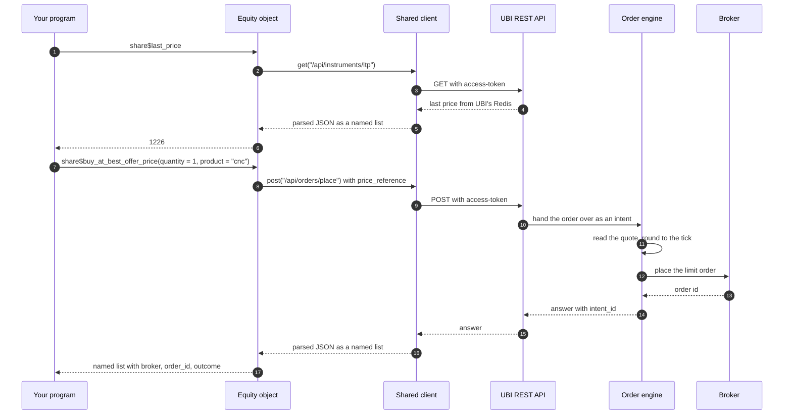

# Architecture

This section explains how the package is put together and why. The short
version is that `tradeR` is a thin layer of R6 objects over one REST
client, and everything that knows about brokers, prices and order types
lives in the [Unified Broker
Interface](https://pramodathani.github.io/unified_broker_interface/)
(UBI), a separate service that runs on the same machine.

A useful way to picture it is a restaurant. Your program is the diner,
the instrument objects are the menu, the shared client is the one waiter
every table uses, UBI is the kitchen, and the ten brokers are the
suppliers: the menu never cooks anything, it only tells the waiter what
to ask the kitchen for.

## From your program down to the brokers

The animation below shows the five layers between your program and a
broker’s server. The orange dots are reads, such as a quote, a set of
candles or the positions, travelling up to your program. The blue dot is
an order travelling down, through UBI’s order engine, to one broker.

The five layers between your R session and the brokers. Orange dots are
reads coming up from UBI’s stores to your program. The blue dot is an
order going down through the shared client, the REST API and the order
engine to a broker.

The numbered list below describes each layer from the top, with where it
lives.

1.  **Instrument, basket, order and account objects** are what your
    program builds and calls. An `Equity`, an `EquityIndexOption` or a
    `CommodityFutures` is one instrument; a `Portfolio`, a `Watchlist`
    or an `Index` is a basket of instruments; a `BracketOrder` or a
    `TrailingStopOrder` describes one synthetic order; an `Account`
    stands for the whole trading account. They live in the files
    `R/assets_*.R`, `R/asset_baskets_*.R`, `R/orders_*.R` and
    `R/accounts_account.R`. Not one of them holds any market data
    between calls; each read is a fresh request. Baskets are the one
    part that also keeps data of its own, in this project’s MongoDB,
    because UBI stores no index constituents or fund holdings; [Asset
    baskets](https://pramodathani.github.io/tradeR/articles/guide-asset-baskets.md)
    describes them.
2.  **The shared client**,
    [`UnifiedBrokerInterface`](https://pramodathani.github.io/tradeR/reference/UnifiedBrokerInterface.md)
    in `R/unified_broker_interface_client.R`, is the only code that
    speaks HTTP, through the `httr2` package. Every object in an R
    session sends its requests through the same client, because UBI
    holds a single access token for the whole application and a second
    client would log the first one out. The client connects on first
    use, reconnects and retries once on HTTP 401, and turns each failure
    status into its own condition class.
3.  **UBI’s REST API** listens on `http://127.0.0.1:8080`. It answers
    almost every read from its own Redis and TimescaleDB, which its
    background scripts keep filled from the brokers, so a read never
    waits for a broker. It is documented route by route on the [UBI
    site](https://pramodathani.github.io/unified_broker_interface/rest-api/).
4.  **UBI’s order engine** is a separate UBI process that places every
    order on the REST API’s behalf. It works out prices and quantities
    that were described rather than stated, holds plain limit orders
    until the book reaches their price, and runs the synthetic order
    types, 54 named types and the plan, some of which keep placing
    orders long after your call has returned. See [Order
    engine](https://pramodathani.github.io/unified_broker_interface/rest-api/order-engine/)
    on the UBI site.
5.  **The ten brokers** are Dhan, Flattrade, Fyers, Groww, INDmoney,
    Kotak, Shoonya, Stoxkart, Wisdom Capital and Zerodha. UBI logs in to
    each of them and chooses which one sends a given order; this package
    never names a broker and never talks to one.

**What the package does not do.**

The package keeps no cache, batches no date ranges, rounds no prices to
the tick and checks no quantities against the lot size. UBI already does
each of those, or holds the rule, and doing it again here would create a
second copy that could drift. [Design
choices](https://pramodathani.github.io/tradeR/articles/architecture-design-choices.md)
records each decision.

## Which layer may talk to which

The rules below keep the layers independent. The table shows, for each
part, what it is allowed to call.

| Part | Calls the shared client | Calls UBI over HTTP | Calls a broker | Keeps state between calls |
|----|----|----|----|----|
| Your program | Through the objects, or directly for a route no object wraps | No | No | Whatever it chooses |
| Instrument, order and account objects | Yes | No, only through the client | No | Only the instrument’s identity, lot size and tick size, read once at construction |
| Basket objects and `BasketStore` | Yes | No, only through the client | No | The members and their weights or quantities, saved in this project’s MongoDB |
| Shared client, `UnifiedBrokerInterface` | Not applicable, it is the client | Yes, the only code that does | No | The access token and its expiry |
| UBI REST API | No | Not applicable, it is the API | Yes, for modifications, cancellations and flatten’s cancels, and for a quote when no fresh one is cached | Everything, in Redis, TimescaleDB and MongoDB |
| UBI order engine | No | No | Yes, every placement | Held limit orders and armed and working synthetic orders |
| Brokers | No | No | Not applicable | The real orders, trades, positions and holdings |

The one rule that matters most for a caller is the second row. An
instrument object never opens its own connection, so any number of
instruments, baskets, synthetic orders and an `Account` can live in one
R session and share one login. [The instrument
model](https://pramodathani.github.io/tradeR/articles/architecture-instrument-model.html#one-shared-client)
explains how the client is shared.

## A read and an order, side by side

The sequence below shows the two kinds of request the layers carry: a
read of the last price, which UBI answers from memory, and an order that
carries a price reference, which the order engine resolves and sends to
a broker.

Every order takes the second path, through the engine. A plain limit
order stops at the engine, which holds it until the book reaches its
price; [Order
engine](https://pramodathani.github.io/tradeR/articles/architecture-order-engine.md)
describes that and the parents the engine keeps.

## Where to go next

The articles in this section go deeper into each part of the design, as
the list below describes.

- **[The instrument
  model](https://pramodathani.github.io/tradeR/articles/architecture-instrument-model.md)**
  covers the class hierarchy from `Instrument` to the 27 family classes,
  the single chain of analysis classes underneath it, what lives at each
  level, and how the baskets, the synthetic orders and the account
  relate to it.
- **[Order
  engine](https://pramodathani.github.io/tradeR/articles/architecture-order-engine.md)**
  explains what the package sends as descriptions rather than values,
  why a plain limit order is held, what a parent is, and how to read an
  answer that arrived late.
- **[Design
  choices](https://pramodathani.github.io/tradeR/articles/architecture-design-choices.md)**
  records the decisions that shape the package, each with its problem,
  its reasoning, its cost and where to see it in the code. It keeps the
  twelve decisions of the Python library and adds the ones the R port
  made.
- **[Repository
  structure](https://pramodathani.github.io/tradeR/articles/project-structure.md)**
  lists every file in `R/`, how many there are, and how they are
  grouped.
