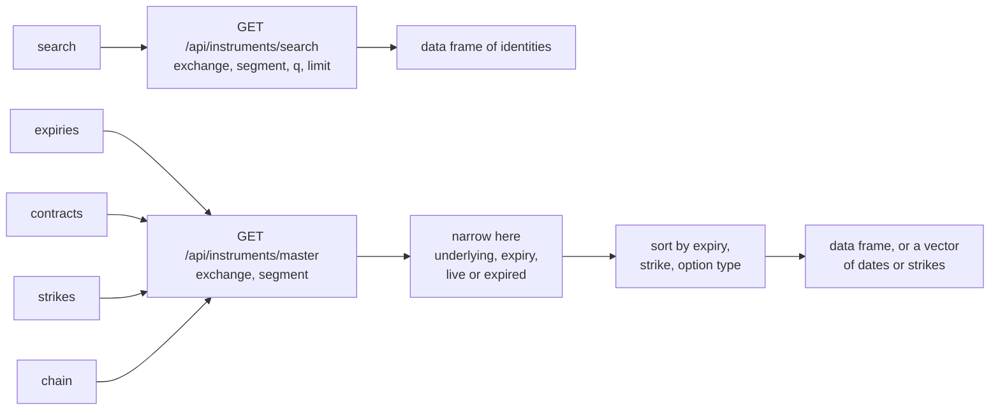

# Finding instruments

These functions find instruments you do not already know by name: a
share from part of its symbol, the expiries a futures or option
underlying has, the strikes listed for one expiry, and a whole option
chain. They stand in for the Python library’s class methods, so they are
stored on the class generator and called as `Equity$search(...)` rather
than on an object, because they run before you have an instrument to
hold, and each class fills in its own segment so you never type one.

The table below lists the five kinds of call. Every one of them reads
UBI’s instrument list and nothing else, so none of them can place an
order.

| Kind | Member | Description |
|----|----|----|
| function on the class generator | [`search`](#search) | Securities or indices whose symbol contains a term, as a data frame of identities |
| function on the class generator | [`expiries`](#expiries) | The live expiry dates of one underlying’s futures or options, as a `Date` vector |
| function on the class generator | [`contracts`](#contracts) | The futures contracts in the segment, optionally for one underlying, as a data frame |
| function on the class generator | [`strikes`](#strikes) | The strike prices listed for one underlying and one expiry, as a numeric vector |
| function on the class generator | [`chain`](#chain) | Every option for one underlying and one expiry, as a data frame |

Which class has which call depends on the class’s shape. `search` is
written on each cash and index class, and the other four are written on
each futures or option class. R6 class generators do not inherit
functions stored on them, so each of the twenty-seven classes carries
its own copy, which names its own segment, and all of them hand the work
to one helper class,
[`InstrumentCatalogue`](https://pramodathani.github.io/tradeR/reference/InstrumentCatalogue.md).
The table below shows the split across all twenty-seven classes.

| Classes | `search` | `expiries` | `contracts` | `strikes` | `chain` |
|----|:--:|:--:|:--:|:--:|:--:|
| `Equity`, `EquityIndex`, `FixedIncome`, `FixedIncomeIndex`, `Commodity`, `CommodityIndex`, `Currency`, `CurrencyIndex`, `ExchangeTradedFund`, `InvestmentTrust`, `MutualFund` | Yes |  |  |  |  |
| `EquityFutures`, `EquityIndexFutures`, `FixedIncomeFutures`, `FixedIncomeIndexFutures`, `CommodityFutures`, `CommodityIndexFutures`, `CurrencyFutures`, `CurrencyIndexFutures` |  | Yes | Yes |  |  |
| `EquityOption`, `EquityIndexOption`, `FixedIncomeOption`, `FixedIncomeIndexOption`, `CommodityOption`, `CommodityIndexOption`, `CurrencyOption`, `CurrencyIndexOption` |  | Yes |  | Yes | Yes |

The strings these calls accept are exchanges such as `nse` and `mcx`,
and dates as a `Date` or `YYYY-MM-DD`;
[Vocabulary](https://pramodathani.github.io/tradeR/articles/guide-vocabulary.md)
lists them all.

**Call them on a family class.**

The base classes name no segment. `Futures$expiries()` and
`Futures$contracts()` exist only to signal
[`FuturesError`](https://pramodathani.github.io/tradeR/articles/guide-errors.html#futureserror),
and `Option$expiries()`, `Option$strikes()` and `Option$chain()` signal
[`OptionError`](https://pramodathani.github.io/tradeR/articles/guide-errors.html#optionerror),
as the Python base classes do. `IndexFutures` and `IndexOption` carry no
discovery functions at all in R, so `IndexFutures$expiries` is `NULL`
and calling it fails with R’s “attempt to apply non-function” error.
Call them on a family class such as `EquityFutures` or
`CommodityIndexOption`.

## Why two different UBI routes

UBI offers two ways to list instruments, and they suit different jobs.
Its search route ranks names well but returns at most 200 rows, sorted
by expiry with the oldest first, and has no way to ask for the next
page. Its master route returns a whole segment with no limit but takes
no filters.

For a share or an index that difference does not matter, because there
is one row per name. For a derivative it decides everything. A search
for NIFTY index options on 2026-09-20 with the maximum limit of 200
returned 200 rows that all shared one expiry, 2026-08-25, which had
passed four weeks earlier; every live contract sat behind thousands of
dead ones and could never be reached. So the package uses search only
for names, and fetches the master list and narrows it itself for
contracts.

The flowchart below shows which route each call uses, and what the
package does to the answer.



The master list is fast because UBI is on the same machine and streams
it. The table below shows the sizes, and the times the Python library
took to fetch them, measured on 2026-09-20; the R port has not been
timed.

| Segment                    | Rows    | Time to fetch |
|----------------------------|---------|---------------|
| `nse_equity_index_futures` | 23      | 0.0 s         |
| `nse_equity_index_options` | 14,826  | 0.2 s         |
| `nse_equity_options`       | 125,967 | 1.3 s         |

**Every call fetches the list again.**

Nothing is cached, so asking for `expiries` and then a `chain` downloads
the segment twice. For single-stock options that took about two seconds
a call in Python. A stale expiry list would be a worse failure than a
slow one, which is why the package does not keep the list between calls.

## Rows, not objects

`search`, `contracts` and `chain` return a `data.frame` of identities
rather than instrument objects. Building an object sends one lookup to
UBI, so returning a 538-contract NIFTY chain as objects would mean 538
requests, where returning rows means none. Build the two or three
contracts you actually want from their rows.

The table below lists the columns an identity data frame has. A row
carries no `lot_size`, `tick_size` or `carried_by`; those arrive only
when you build the object. A value UBI leaves empty becomes `NA`, and a
column that UBI leaves empty in every row comes out as logical `NA`.

| Column | Type | Description |
|----|----|----|
| `instrument_id` | character | UBI’s UUID for the instrument |
| `exchange` | character | The exchange, lower case |
| `segment` | character | The exchange-prefixed segment |
| `shape` | character | `security`, `future` or `option` |
| `symbol` | character or `NA` | The symbol of a security, `NA` for a contract |
| `underlying_symbol` | character or `NA` | The underlying of a contract, `NA` for a security |
| `expiry_date` | `Date` or `NA` | The expiry, converted from UBI’s text into a real `Date` |
| `strike_price` | numeric or `NA` | The strike of an option |
| `option_type` | character or `NA` | `CE` or `PE` for an option |

## search

The function is called as
`Equity$search(exchange, term, limit = 50, unified_broker_interface = NULL)`,
and it sends `GET /api/instruments/search`.

This function finds instruments in the class’s own segment whose symbol
contains a term, matched without regard to case. UBI puts an exact match
first, then symbols that start with the term, then symbols that contain
it anywhere, so a partial name such as `RELI` finds RELIANCE near the
top. It is on the eleven classes named by exchange and symbol, and its
default limit is the package constant `EQUITIES_SEARCH_LIMIT`, or the
matching constant of the other families, all of which are 50.

#### Parameters

The table below lists the function’s arguments.

| Name | Type | Required | Default | Description |
|----|----|----|----|----|
| `exchange` | character | Yes |  | The exchange to search, such as `nse` |
| `term` | character | Yes |  | The text the symbol must contain |
| `limit` | integer | No | `50` | The most rows to return. UBI caps it at 200. |
| `unified_broker_interface` | `UnifiedBrokerInterface` or `NULL` | No | `NULL` | The client, or `NULL` for the shared one |

#### Example

The example below searches for shares whose symbol contains `RELI` and
for indices whose symbol contains `NIFTY`, five rows at most each. When
the Python version was captured from a local UBI on 2026-09-26, the
share search found only four matches, RELIABLE, RELIANCE, RELIGARE and
RELINFRA in that order, and the index search returned NIFTY, NIFTY 100,
NIFTY 200, NIFTY 500 and NIFTY ALPHA 50.

``` r

shares <- Equity$search(exchange = "nse", term = "RELI", limit = 5)
print(shares)

indices <- EquityIndex$search(exchange = "nse", term = "NIFTY", limit = 5)
print(indices)
```

#### Returns

A `data.frame` of identities, with the [columns
above](#rows-not-objects), or `NULL` when nothing matches. The columns
arrive in the order UBI sends them, which is alphabetical.

#### Errors

The table below lists the conditions the function can signal.

| Condition | When |
|----|----|
| [`BadRequestError`](https://pramodathani.github.io/tradeR/articles/guide-errors.html#badrequesterror) | The exchange is not one UBI knows |
| [`UnifiedBrokerInterfaceError`](https://pramodathani.github.io/tradeR/articles/guide-errors.html#unifiedbrokerinterfaceerror) | Any other failure reported by, or on the way to, UBI |

## expiries

The function is called as
`EquityIndexOption$expiries(exchange, underlying_symbol, include_expired = FALSE, unified_broker_interface = NULL)`,
and it sends `GET /api/instruments/master`.

This function lists the expiry dates one underlying has contracts for in
the class’s segment, soonest first. A contract that expires today counts
as live, because it can still be traded until the close, and “today” is
measured in India time. It is on all sixteen futures and option classes.

#### Parameters

The table below lists the function’s arguments.

| Name | Type | Required | Default | Description |
|----|----|----|----|----|
| `exchange` | character | Yes |  | The exchange, such as `nse` or `mcx` |
| `underlying_symbol` | character | Yes |  | The underlying, such as `NIFTY`, `RELIANCE` or `GOLD`. It is upper-cased before comparing. |
| `include_expired` | logical | No | `FALSE` | `TRUE` to include expiries that have already passed |
| `unified_broker_interface` | `UnifiedBrokerInterface` or `NULL` | No | `NULL` | The client, or `NULL` for the shared one |

#### Example

The example below lists the expiries of NIFTY index options, RELIANCE
share futures and MCX gold futures.

``` r

print(EquityIndexOption$expiries(exchange = "nse", underlying_symbol = "NIFTY"))
print(EquityFutures$expiries(exchange = "nse", underlying_symbol = "RELIANCE"))
print(CommodityFutures$expiries(exchange = "mcx", underlying_symbol = "GOLD"))
```

The table below lists what the Python version of these three calls
returned when it was captured from a local UBI on 2026-09-26.

| Call | Expiries returned |
|----|----|
| NIFTY index options | 2026-09-29, 2026-10-06, 2026-10-13, 2026-10-19, 2026-10-27, 2026-11-03, 2026-11-23, 2026-12-29, 2027-03-30, 2027-06-29, 2027-12-28, 2028-06-27, 2028-12-26, 2029-06-26, 2029-12-24, 2030-06-25, 2030-12-31, 2031-06-24 |
| RELIANCE share futures | 2026-09-29, 2026-10-27, 2026-11-23 |
| MCX gold futures | 2026-10-05, 2026-12-04, 2027-02-05, 2027-04-05, 2027-06-04, 2027-08-05 |

The chart below places the eighteen captured NIFTY option expiries on a
calendar. The weekly expiries crowd the first two months, and the
long-dated ones run out to June 2031.


#### Returns

A `Date` vector, soonest first, which is empty when nothing is listed on
the underlying.

#### Errors

The table below lists the conditions the function can signal.

| Condition | When |
|----|----|
| [`BadRequestError`](https://pramodathani.github.io/tradeR/articles/guide-errors.html#badrequesterror) | The exchange is not one UBI knows |
| [`UnifiedBrokerInterfaceError`](https://pramodathani.github.io/tradeR/articles/guide-errors.html#unifiedbrokerinterfaceerror) | Any other failure reported by, or on the way to, UBI |

## contracts

The function is called as
`EquityIndexFutures$contracts(exchange, underlying_symbol = NULL, include_expired = FALSE, unified_broker_interface = NULL)`,
and it sends `GET /api/instruments/master`.

This function lists the futures contracts in the class’s segment, for
one underlying or for every underlying when `underlying_symbol` is left
out. It is on the eight futures classes, and it is the futures
counterpart of `chain`.

#### Parameters

The table below lists the function’s arguments.

| Name | Type | Required | Default | Description |
|----|----|----|----|----|
| `exchange` | character | Yes |  | The exchange, such as `nse` |
| `underlying_symbol` | character or `NULL` | No | `NULL` | The underlying to keep, or `NULL` for every underlying in the segment |
| `include_expired` | logical | No | `FALSE` | `TRUE` to include contracts whose expiry has passed |
| `unified_broker_interface` | `UnifiedBrokerInterface` or `NULL` | No | `NULL` | The client, or `NULL` for the shared one |

#### Example

The example below lists the NIFTY futures and builds the nearest one
from its row. No output was captured for this call. A check recorded in
the Python project’s notes on 2026-09-20 found that the same call
returned the three live quarterly contracts.

``` r

nifty_futures <- EquityIndexFutures$contracts(
  exchange = "nse",
  underlying_symbol = "NIFTY"
)
nearest <- nifty_futures[1, ]
contract <- EquityIndexFutures$new(
  exchange = nearest$exchange,
  underlying_symbol = nearest$underlying_symbol,
  expiry_date = nearest$expiry_date
)
```

#### Returns

A `data.frame` of identities with the [columns
above](#rows-not-objects), sorted by expiry, or `NULL` when nothing
matches.

#### Errors

The table below lists the conditions the function can signal.

| Condition | When |
|----|----|
| [`BadRequestError`](https://pramodathani.github.io/tradeR/articles/guide-errors.html#badrequesterror) | The exchange is not one UBI knows |
| [`UnifiedBrokerInterfaceError`](https://pramodathani.github.io/tradeR/articles/guide-errors.html#unifiedbrokerinterfaceerror) | Any other failure reported by, or on the way to, UBI |

## strikes

The function is called as
`EquityIndexOption$strikes(exchange, underlying_symbol, expiry_date, include_expired = FALSE, unified_broker_interface = NULL)`,
and it sends `GET /api/instruments/master`.

This function lists the strike prices listed for one underlying and one
expiry, lowest first, with each strike appearing once even though it has
a call and a put. It builds the [`chain`](#chain) and takes its distinct
strikes, so it costs the same as a chain. It is on the eight option
classes.

#### Parameters

The table below lists the function’s arguments.

| Name | Type | Required | Default | Description |
|----|----|----|----|----|
| `exchange` | character | Yes |  | The exchange, such as `nse` |
| `underlying_symbol` | character | Yes |  | The underlying, such as `NIFTY` |
| `expiry_date` | `Date` or character | Yes |  | The expiry, usually one returned by [`expiries`](#expiries) |
| `include_expired` | logical | No | `FALSE` | `TRUE` to allow an expiry that has already passed |
| `unified_broker_interface` | `UnifiedBrokerInterface` or `NULL` | No | `NULL` | The client, or `NULL` for the shared one |

#### Example

The example below lists the strikes for the first NIFTY expiry. When the
Python version was captured from a local UBI on 2026-09-26, the first
expiry was 2026-09-29 and the call returned 269 strikes from 1500 to
49500. The middle of the list ran in steps of 50 from 17800 to 30000,
and the ends ran in steps of 1500, so the list began 1500, 3000, 4500
and ended 46500, 48000, 49500.

``` r

expiries <- EquityIndexOption$expiries(
  exchange = "nse",
  underlying_symbol = "NIFTY"
)
strikes <- EquityIndexOption$strikes(
  exchange = "nse",
  underlying_symbol = "NIFTY",
  expiry_date = expiries[[1]]
)
print(length(strikes))
print(strikes)
```

#### Returns

A numeric vector of strike prices in rupees, lowest first, which is
empty when nothing is listed for that expiry.

#### Errors

The table below lists the conditions the function can signal.

| Condition | When |
|----|----|
| [`BadRequestError`](https://pramodathani.github.io/tradeR/articles/guide-errors.html#badrequesterror) | The exchange is not one UBI knows |
| A plain R error reading “Invalid isoformat string” | `expiry_date` is a string that is not a valid ISO date |
| [`UnifiedBrokerInterfaceError`](https://pramodathani.github.io/tradeR/articles/guide-errors.html#unifiedbrokerinterfaceerror) | Any other failure reported by, or on the way to, UBI |

## chain

The function is called as
`EquityIndexOption$chain(exchange, underlying_symbol, expiry_date, include_expired = FALSE, unified_broker_interface = NULL)`,
and it sends `GET /api/instruments/master`.

This function lists every option for one underlying and one expiry, a
call and a put at each strike, sorted by strike and then by option type.
It is on the eight option classes, and it is the usual starting point
for building an option object, because each row carries the exact
identity values the constructor needs.

#### Parameters

The table below lists the function’s arguments.

| Name | Type | Required | Default | Description |
|----|----|----|----|----|
| `exchange` | character | Yes |  | The exchange, such as `nse` |
| `underlying_symbol` | character | Yes |  | The underlying, such as `NIFTY` |
| `expiry_date` | `Date` or character | Yes |  | The expiry |
| `include_expired` | logical | No | `FALSE` | `TRUE` to allow an expiry that has already passed |
| `unified_broker_interface` | `UnifiedBrokerInterface` or `NULL` | No | `NULL` | The client, or `NULL` for the shared one |

#### Example

The example below builds the NIFTY chain for the first expiry and prints
its first five rows. When the Python version was captured from a local
UBI on 2026-09-26 for NIFTY’s 2026-09-29 expiry, the chain had 538 rows
and nine columns, which is 269 strikes with a call and a put each. Its
first five rows were the 1500 call, the 1500 put, the 3000 call, the
3000 put and the 4500 call, each in the `nse_equity_index_options`
segment with `NIFTY` as the underlying and no symbol.

``` r

chain <- EquityIndexOption$chain(
  exchange = "nse",
  underlying_symbol = "NIFTY",
  expiry_date = expiries[[1]]
)
print(dim(chain))
print(head(chain, 5))
```

In R, `symbol` is `NA` in every row of a chain, because an option has no
symbol of its own, and `expiry_date` is a `Date` column.

#### Returns

A `data.frame` of identities with the [columns
above](#rows-not-objects), or `NULL` when nothing matches.

#### Errors

The table below lists the conditions the function can signal.

| Condition | When |
|----|----|
| [`BadRequestError`](https://pramodathani.github.io/tradeR/articles/guide-errors.html#badrequesterror) | The exchange is not one UBI knows |
| A plain R error reading “Invalid isoformat string” | `expiry_date` is a string that is not a valid ISO date |
| [`UnifiedBrokerInterfaceError`](https://pramodathani.github.io/tradeR/articles/guide-errors.html#unifiedbrokerinterfaceerror) | Any other failure reported by, or on the way to, UBI |

## include_expired

Every call except `search` takes `include_expired`, and it defaults to
`FALSE`, because the first row of an unfiltered list is almost always a
dead contract. With `TRUE`, contracts whose expiry has passed are kept,
which is useful for looking back at a contract you once held. The check
on 2026-09-20 showed the difference for RELIANCE share futures, and the
table below reproduces it in R form.

| Call | Expiries returned |
|----|----|
| `EquityFutures$expiries("nse", "RELIANCE")` | 2026-09-29, 2026-10-27, 2026-11-23 |
| `EquityFutures$expiries("nse", "RELIANCE", include_expired = TRUE)` | 2026-08-25, 2026-09-29, 2026-10-27, 2026-11-23 |

UBI keeps only the instruments it has mapped, so how far back an expired
list reaches depends on how long UBI has been running, not on this
package.

## From a row to an object

A discovery row is only an identity. To quote or trade it, pass its
identity fields to the class’s constructor, which looks it up once and
returns the full object. The example below does this for the nearest MCX
gold future. When the Python version was captured from a local UBI on
2026-09-26, the contract printed as
`CommodityFutures(exchange='mcx', segment='mcx_commodity_futures', underlying_symbol='GOLD', expiry_date='2026-10-05')`,
with a lot size of 100, a tick size of 1 and a last price of 150734.0.

``` r

expiries <- CommodityFutures$expiries(
  exchange = "mcx",
  underlying_symbol = "GOLD"
)
gold <- CommodityFutures$new(
  exchange = "mcx",
  underlying_symbol = "GOLD",
  expiry_date = expiries[[1]]
)
print(gold)
cat(gold$lot_size, gold$tick_size, "\n")
print(gold$last_price)
```

For an option, take the row from `chain` and pass its `exchange`,
`underlying_symbol`, `expiry_date`, `strike_price` and `option_type` to
the option class.
[Instruments](https://pramodathani.github.io/tradeR/articles/guide-instruments.html#named-by-underlying-expiry-strike-and-option-type)
records the check that proved a row and a constructed object always
share the same `instrument_id`.

**Under the hood.**

`search` sends `exchange`, `segment`, `q` and `limit` to
[Search](https://pramodathani.github.io/unified_broker_interface/rest-api/instruments/#search).
The other four send `exchange` and `segment` to
[Master](https://pramodathani.github.io/unified_broker_interface/rest-api/instruments/#master),
then keep the rows whose `underlying_symbol` equals the upper-cased
underlying, whose expiry matches when one was given, and whose expiry is
today or later in India time unless `include_expired` is `TRUE`. The
mechanism lives in the methods of
[`InstrumentCatalogue`](https://pramodathani.github.io/tradeR/reference/InstrumentCatalogue.md),
which stand in for the Python library’s protected class methods on
`Instrument`. Each family class’s functions build a catalogue and pass
their own segment constant, such as `EQUITIES_EQUITY_OPTIONS_SEGMENT`,
so each named class supplies its own segment in its own file.
