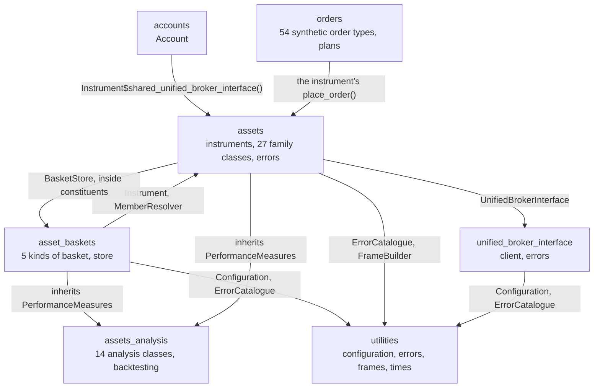

# Repository structure

The repository is an R package with its documentation, its tests and the
notes that explain it. All package code lives in the one flat `R/`
directory, as R requires, so the Python library’s package path becomes a
file name prefix joined with underscores:
`src/tradingmachine/assets/equities.py` became `R/assets_equities.R`.
The package is used either installed, with `devtools::install()`, or
loaded straight from the repository while working on it, with
`devtools::load_all()`.

## The tree

The annotated tree below shows every directory and the files that
matter. The 54 synthetic order files, the 52 plan part files, the 14
analysis files and the 110 test files are summarised rather than listed
one by one.

``` text
tradeR/
├── DESCRIPTION                    the package's metadata, its 6 imported packages, the 2 suggested ones and R >= 4.3
├── NAMESPACE                      the exported names, generated by devtools::document() and committed
├── LICENSE, LICENSE.md            the MIT licence, short form for R and full text for GitHub
├── README.md                      the home page of this site
├── _pkgdown.yml                   this site's configuration: url, theme, Mermaid, navbar and reference sections
├── .Rbuildignore                  keeps .claude, .env, docs, _pkgdown.yml, .github and vignettes/articles out of the built package
├── .gitignore                     keeps .env, docs/ and R's working files out of git
├── .github/workflows/pkgdown.yaml builds this site on every push to main and publishes it to the gh-pages branch
├── .claude/
│   ├── CLAUDE.md                  a dense description of the port for AI assistants, kept out of the site root
│   └── notes/                     one sidecar note per file, mirroring the tree, holding the reasoning
├── man/                           201 .Rd help pages, generated from roxygen2 comments and committed
├── vignettes/articles/            these guides as R Markdown, and their diagrams in diagrams/
├── tests/
│   ├── testthat.R                 runs the suite with test_check("tradeR")
│   └── testthat/
│       ├── helper-*.R             5 helpers: a fake client, fake instrument details, a fake MongoDB collection and candles
│       ├── fixtures/              4 CSV files of candles and of the Python library's signals to compare against
│       └── test-*.R               110 test files, each named after the file in R/ it tests
└── R/
    ├── tradeR-package.R               the package help page and the imports from the six packages
    ├── accounts_account.R             Account, whose flatten is UBI's account-wide kill switch
    ├── asset_baskets_asset_basket.R   AssetBasket, the shared base, which inherits the 14 analysis classes
    ├── asset_baskets_basket_member.R  BasketMember, one instrument with a weight, a quantity, or neither
    ├── asset_baskets_portfolio.R      Portfolio, which can place and rebalance orders
    ├── asset_baskets_watchlist.R      Watchlist
    ├── asset_baskets_index.R          Index, the constituents of an index
    ├── asset_baskets_exchange_traded_fund_constituents.R
    ├── asset_baskets_mutual_fund_constituents.R
    ├── asset_baskets_basket_store.R   BasketStore, the asset_baskets collection in MongoDB
    ├── asset_baskets_basket_csv_importer.R  BasketCsvImporter, which fills the store from a CSV file
    ├── asset_baskets_member_resolver.R      MemberResolver, which builds every member in one request
    ├── asset_baskets_exceptions.R     AssetBasketError and its 3 subclasses
    ├── assets_instruments.R           Instrument, TradeableInstrument, NonTradeableInstrument,
    │                                  Derivative, Futures, Option, IndexFutures, IndexOption, InstrumentCatalogue
    ├── assets_option_pricing.R        OptionPricingModel, BlackScholes and Black76
    ├── assets_equities.R              6 equity-family classes
    ├── assets_fixed_income.R          6 fixed income classes
    ├── assets_commodities.R           6 commodity classes
    ├── assets_currencies.R            6 currency classes
    ├── assets_funds.R                 ExchangeTradedFund, InvestmentTrust
    ├── assets_mutual_funds.R          MutualFund
    ├── assets_exceptions.R            InstrumentError and its 37 subclasses
    ├── assets_analysis_price_analysis.R  PriceAnalysis, the shared base
    ├── assets_analysis_*.R            14 files, one analysis class each, inherited by Instrument and AssetBasket
    ├── assets_analysis_backtesting_*.R   8 files, the backtesting engine StrategyBacktests runs on
    ├── orders_synthetic_order.R       SyntheticOrder, the shared base
    ├── orders_order_candidate.R       OrderCandidate, one leg of a multi-instrument order
    ├── orders_exposure_watch.R        ExposureWatch, one watched instrument of an exposure hedge
    ├── orders_plan.R                  PlanOrder, an order described as a plan of parts
    ├── orders_plan_parts_*.R          52 files, one plan part each
    ├── orders_*.R                     54 files, one synthetic order type each, such as orders_bracket.R
    ├── unified_broker_interface_client.R      UnifiedBrokerInterface, the only code that speaks HTTP
    ├── unified_broker_interface_exceptions.R  one error class per HTTP status UBI returns
    ├── utilities_configuration.R      Configuration, which reads the environment and .env lazily
    ├── utilities_error_catalogue.R    ErrorCatalogue, which builds conditions with the Python class names
    ├── utilities_frame_builder.R      FrameBuilder, which turns UBI's rows into data frames
    └── utilities_time_converter.R     TimeConverter, which turns UBI's dates and times into Date and POSIXct
```

`docs/`, the built site, and `.env` are also present on a working
machine, and `.gitignore` keeps both of them out of git. `inst/` exists
but is empty. The project instructions live in `.claude/CLAUDE.md`
rather than at the root, because pkgdown publishes every Markdown file
at the repository root as a page of the site.

## File counts

The table below counts the R files and lines in each group of files
under `R/`, measured on 2026-10-07. A group is every file sharing a name
prefix, which is the R form of a Python package. The lines include each
file’s roxygen2 documentation and examples, which in R sit beside the
code in the same file. The last column names only the packages from
`Imports` in `DESCRIPTION`; base R’s own `stats`, `utils` and `graphics`
are left out.

| Group of files | R files | Lines | What it holds | Imported packages it calls |
|----|---:|---:|----|----|
| `tradeR-package.R` | 1 | 17 | The package help page and the imports | all six, through `@importFrom` |
| `accounts_*` | 1 | 146 | `Account` | `R6` |
| `asset_baskets_*` | 11 | 5,225 | `AssetBasket`, the five kinds of basket, their store, importer, resolver and errors | `R6`, `mongolite`, `jsonlite` |
| `assets_*`, without analysis | 9 | 21,633 | The instrument classes, `InstrumentCatalogue`, the 27 family classes, the option pricing models and their errors | `R6` |
| `assets_analysis_*`, without backtesting | 15 | 13,750 | `PriceAnalysis` and the 14 analysis classes | `R6`, `talib` |
| `assets_analysis_backtesting_*` | 8 | 2,651 | The backtesting engine, the R counterpart of the Python `backtesting` package | `R6` |
| `orders_*`, without plan parts | 58 | 8,465 | `SyntheticOrder`, `OrderCandidate`, `ExposureWatch`, `PlanOrder` and 54 order types | `R6` |
| `orders_plan_parts_*` | 52 | 3,980 | The plan parts a `PlanOrder` is built from | `R6` |
| `unified_broker_interface_*` | 2 | 551 | `UnifiedBrokerInterface` and its 13 error classes | `httr2`, `jsonlite`, `mongolite` |
| `utilities_*` | 4 | 648 | `Configuration`, `ErrorCatalogue`, `FrameBuilder` and `TimeConverter` | `dotenv` |
| **Total** | **161** | **57,066** |  |  |

The chart below shows the same line counts, which makes it plain that
the package’s weight is in its instruments and their analysis, not in
its plumbing. The instrument files are the largest single group because
`R/assets_instruments.R` alone documents the thirty-two price wrappers
and every order, position and order-book member that each family class
inherits.


A bar chart of the lines of R in each group of files, from assets with
21,633 down to the package file with 17

`.claude/notes/` holds 162 notes. Every file in `R/` has one except the
three files that only list error classes and hold no reasoning worth
recording: `R/assets_exceptions.R`, `R/asset_baskets_exceptions.R` and
`R/unified_broker_interface_exceptions.R`. The other four notes cover
`DESCRIPTION`, `_pkgdown.yml`, the pkgdown workflow and the client’s
test file.

## Which group uses which

R has no imports between the files of one package: every file is loaded
into the package’s single namespace, so any file can name any class. The
dependencies are therefore the classes one file names from another
group, by inheriting it or by calling a function on it. The diagram
below shows them, read from the source. An arrow means “uses”, and the
dependencies run one way only, from the objects you use down to the
client, the configuration and the utilities.



Four details of the graph are worth knowing.

- `orders` does not name `UnifiedBrokerInterface`. A synthetic order
  sends itself through the instrument’s `place_order()`, so the shared
  client applies to it without any code of its own, and its `cancel()`
  and `parent` go through the instrument’s parent members in the same
  way.
- `accounts` names `Instrument` only to call
  `Instrument$shared_unified_broker_interface()`, so that an `Account`
  shares the instruments’ client instead of starting a second one.
- `assets` and `asset_baskets` use each other, which in Python needed an
  import inside a property’s body to avoid a circular import. R needs no
  such care: `NonTradeableInstrument`’s `constituents`, and the same
  binding on `ExchangeTradedFund` and `MutualFund`, simply create a
  `BasketStore` when first read. R6 also looks up a parent class when an
  object is created, not when the file is loaded, so the alphabetical
  order in which R loads the files never matters and `DESCRIPTION` needs
  no `Collate` field.
- Inside `assets`, every family file names classes from
  `R/assets_instruments.R`, and `Instrument` alone inherits the analysis
  chain, which ends in `PerformanceMeasures`. `AssetBasket` inherits the
  same chain, so a basket inherits exactly what an instrument does.
  Inside `orders`, every type inherits `SyntheticOrder`, and the
  multi-instrument types also use `OrderCandidate` or `ExposureWatch`.

Loading the package with
[`library(tradeR)`](https://pramodathani.github.io/tradeR/) defines the
classes and nothing else, so it never reaches for the network, the
databases or the `.env` file. The first object you create is what reads
the configuration and connects.
