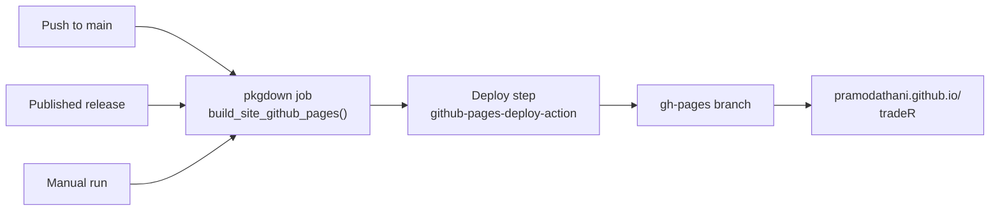
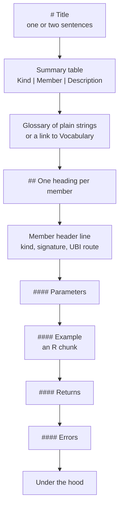
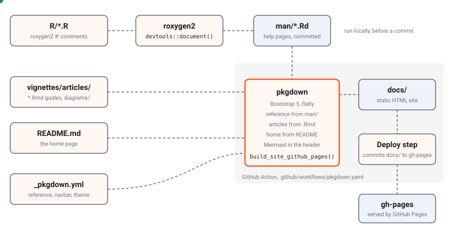

# Writing these docs

This site is built with pkgdown, the standard documentation site
generator for R packages. Its hand-written guides live in
`vignettes/articles/` as R Markdown files, its home page is the
package’s `README.md`, and its reference section is generated from the
roxygen2 comments in `R/`, by way of the help pages in `man/`. Docs live
with the code and change in the same commit as it.

The diagram below shows how the parts come together in one build. Blue
dots are roxygen2 comments becoming help pages and then reference pages,
orange dots are hand-written articles, the README and the configuration,
and green dots are the finished HTML on its way to GitHub Pages. The
grey area is what the GitHub Action does on every push to `main`; the
top row is run by hand before a commit.


How this site is built: roxygen2 comments in R become man pages, and
pkgdown turns man, the articles, the README and the configuration into a
site that a GitHub Action publishes to the gh-pages branch

## Previewing and building

The documentation toolchain is `roxygen2` and `pkgdown`, which
`devtools` installs as its own dependencies, and `rmarkdown`, which
`DESCRIPTION` names under `Config/Needs/website`. The commands below
cover almost everything, all run in R from the repository root.

``` r

devtools::document()
pkgdown::build_site()
pkgdown::preview_site()
pkgdown::build_article("articles/get-started-first-steps")
pkgdown::check_pkgdown()
```

The table below says what each command does.

| Command | What it does |
|----|----|
| `devtools::document()` | Runs roxygen2 over `R/`, rewriting `man/*.Rd` and `NAMESPACE` from the comments |
| [`pkgdown::build_site()`](https://pkgdown.r-lib.org/reference/build_site.html) | Builds the whole site into `docs/`: the home page, the reference and every article |
| [`pkgdown::preview_site()`](https://pkgdown.r-lib.org/reference/preview_site.html) | Opens the built site in a browser |
| `pkgdown::build_article("articles/<name>")` | Rebuilds one article, the quickest way to check an edit to one page |
| [`pkgdown::check_pkgdown()`](https://pkgdown.r-lib.org/reference/check_pkgdown.html) | Checks `_pkgdown.yml` without building anything, including that every help page is in the reference index |

Always run `devtools::document()` after changing a roxygen2 comment, and
commit the regenerated `man/` and `NAMESPACE` with the code. The
published site is built from the committed `man/`, so a comment changed
without regenerating `man/` does not reach the site.
`devtools::document()` should print no warnings, and a new warning is
worth reading: most often it is a `#'` block in front of a private R6
member, which roxygen2 cannot place.

An article can also be rendered on its own, outside the site and without
touching `docs/`, which is the quickest way to make sure it parses:

``` bash
Rscript -e 'rmarkdown::render("vignettes/articles/project-writing-docs.Rmd", output_dir = tempdir(), quiet = TRUE)'
```

The built `docs/` directory is ignored by git and by `R CMD build`, and
never belongs on `main`.

### Publishing

The site is published on GitHub Pages at
<https://pramodathani.github.io/tradeR/>. The GitHub Actions workflow
`.github/workflows/pkgdown.yaml` builds it and deploys it, so nobody
publishes by hand. The table below shows what the workflow does for each
kind of event.

| Event | Builds the site | Publishes it |
|----|:--:|:--:|
| A push to `main` | Yes | Yes |
| A published GitHub release | Yes | Yes |
| A manual run from the Actions tab | Yes | Yes, from the branch it was run on |
| A pull request | No | No |

The flowchart below shows the same thing as a pipeline.



The workflow is the `pkgdown.yaml` example from `r-lib/actions`, the one
`usethis::use_pkgdown_github_pages()` installs, with its pull request
trigger removed, because the repository takes commits on `main`
directly. The numbered list below is what its one job does.

1.  It checks out the repository and installs pandoc and R, using
    Posit’s public package manager so that packages arrive as prebuilt
    binaries.
2.  It installs every package in `DESCRIPTION`, plus pkgdown and tradeR
    itself from the checkout (`local::.`), because pkgdown needs the
    package installed to build its reference pages. The `talib` package
    compiles its bundled TA-Lib C library with CMake, which the
    `ubuntu-latest` runner already has, and the system libraries
    `mongolite` needs are installed through pak’s system requirements
    lookup.
3.  It runs
    `pkgdown::build_site_github_pages(new_process = FALSE, install = FALSE)`,
    which writes the site to `docs/` and adds the `.nojekyll` file
    GitHub Pages needs.
4.  It runs `JamesIves/github-pages-deploy-action`, which commits
    `docs/` to the `gh-pages` branch with `clean: false`, so files on
    `gh-pages` that this build did not write are kept. GitHub Pages
    serves that branch.

The job needs `contents: write` permission to push `gh-pages`;
everything else is read-only. The workflow needs no database, no `.env`,
no UBI and no credentials, because no code is run during the build:
every reference example is wrapped in `\dontrun{}`, and every article
sets `eval = FALSE`. Because there is no pull request check, a broken
page is found by running
[`pkgdown::build_site()`](https://pkgdown.r-lib.org/reference/build_site.html)
locally before pushing, or by the failed run on `main` afterwards.

## The configuration

`_pkgdown.yml` holds the whole site configuration. The table below lists
its top-level keys and what each one does for this site.

| Key | Value here | What it does |
|----|----|----|
| `url` | `https://pramodathani.github.io/tradeR/` | The site’s address, used for links between pages and for the sitemap |
| `template` | Bootstrap 5 with the `flatly` Bootswatch theme | The look of every page |
| `template: includes: in_header` | A `<script type="module">` that loads Mermaid 11 from jsDelivr and starts it with the `neutral` theme | Draws every `<pre class="mermaid">` block on every page |
| `navbar` | Home, reference and articles on the left; search and GitHub on the right | The menu bar |
| `reference` | 17 sections, from “Connecting to UBI” to “Utilities”, each listing its help pages | The grouping of the reference index |
| `articles` | The guides, grouped into menus | The articles menu and index |

pkgdown 2.2.1 and roxygen2 8.1.0 built the current site, and
`DESCRIPTION` records the roxygen2 version under
`Config/roxygen2/version`. The local build used pandoc 3.10.
`DESCRIPTION` also sets `Roxygen: list(markdown = TRUE, r6 = TRUE)`,
which the next section explains, and names the pkgdown site first in
`URL`, because pkgdown reads the first `URL` entry as the site’s
address.

### How the reference is generated

The reference is generated in two stages. roxygen2 turns the comments in
`R/` into help pages in `man/`, and pkgdown turns each help page into a
page of the site. The steps below are what happens to one class.

1.  roxygen2 reads every `#'` block in `R/`. A block in front of an
    [`R6::R6Class()`](https://r6.r-lib.org/reference/R6Class.html) call
    documents the class: its title line, `@description`, `@examples` and
    `@export`. Blocks inside the class document its members: `@field`
    lines for fields and active bindings, and `@description`, `@param`,
    `@return` and `@details` in front of each public method.
2.  Because `DESCRIPTION` sets `r6 = TRUE`, roxygen2 knows how R6
    classes are built. It writes one help page per class, such as
    `man/Equity.Rd`, whose first lines say
    `% Please edit documentation in R/assets_equities.R`. The page lists
    the chain of parent classes under “Super classes”, the active
    bindings, the public methods each under its own heading, and the
    inherited methods in a collapsed list that links to the class that
    defines each one.
3.  Because `DESCRIPTION` sets `markdown = TRUE`, the comments are
    written in Markdown, so backticks, lists and links work as they do
    in these articles.
4.  `@export` adds the class to `NAMESPACE`. Package constants, such as
    the error parent tables, are documented with `@format` and marked
    `@keywords internal`, which keeps them out of R’s help index but
    still gives them a page that `_pkgdown.yml` places in the reference.
5.  pkgdown turns each `man/*.Rd` into `reference/<topic>.html` and
    builds the reference index from the `reference` sections of
    `_pkgdown.yml`. A method’s heading becomes an anchor of the form
    `method-<Class>-<method>`, such as
    `reference/Equity.html#method-Equity-initialize`.

`man/` holds 201 help pages today. pkgdown refuses to build when an
exported help page is missing from the reference index, so a new class
must be added to a section of `_pkgdown.yml`. `tradeR-package` is the
one page left out, because it carries `@keywords internal`.

The roxygen2 conventions in this package matter when you write
documentation, because each one changes what appears. The table below
lists them.

| Convention | Effect |
|----|----|
| `#' @export` on every class | The class is in `NAMESPACE` and gets a help page that must be listed in `_pkgdown.yml` |
| `#' @field` before each active binding | The binding appears under “Active bindings” with its description and type |
| `#' @details Errors: ...` | The conditions a method signals appear under its “Details”, naming each condition class |
| `#` instead of `#'` before a private member | The private member’s documentation stays in the source and out of the help page, without the “can’t find matching R6 method” warning a `#'` block causes |
| `\dontrun{}` around every example | The example is shown but never run, by `R CMD check`, by pkgdown or by the workflow, because every example needs the live UBI |
| Functions on a class generator described in a bulleted list in `@description` | Discovery functions such as `Equity$search()` are documented, although roxygen2 documents only R6 members |
| `@keywords internal` | The page is hidden from R’s help index; pkgdown still builds it if `_pkgdown.yml` lists it |

### Examples in the documentation

Every class carries `@examples` in its roxygen2 block, translated from
the `Examples:` sections of the Python docstrings, and wrapped in
`\dontrun{}`. The class’s `@description` ends with a bulleted list
naming what each example shows, so a reader can find the one they want
before reading the code. pkgdown shows the examples at the bottom of
each reference page without running them.

The Python library also keeps example programs under `examples/` and a
runner, `scripts/run_examples.py`, that runs every example against the
live UBI. This package has neither. Its behaviour is checked by the test
suite instead, which runs every class against `FakeClient` and mocked
HTTP responses from
[`httr2::local_mocked_responses()`](https://httr2.r-lib.org/reference/with_mocked_responses.html),
so `devtools::test()` never reaches UBI.

**The examples place real orders.**

Many examples place, change and cancel real orders at real brokers,
because they are translations of the Python examples, which are verified
for real. Run one by hand only when that is what you intend. During
development, never run an example that places, modifies or cancels an
order unless it passes `dry_run = TRUE`, and never run one that calls
`flatten()`, the holdings methods, `rebalance()` or `place_orders()`
against the live UBI, because those act on positions or holdings that
were there before it ran.

### There is no build hook

The Python site needs a build hook, `scripts/documentation_hooks.py`, to
stop griffe from warning about every `Raises:` section that says only
`Nothing.`, which a strict MkDocs build would turn into a failure. This
site needs nothing of the kind. A method that signals no error simply
has no `@details Errors:` paragraph, and roxygen2 has no warning to
filter.

### Why inherited members are only linked

`Instrument` inherits fourteen analysis classes, and all 27 family
classes inherit from it. If every class page reprinted every inherited
method, each family class would carry the whole analysis surface again.
roxygen2’s R6 pages avoid that by design: inherited methods appear only
as links in a collapsed “Inherited methods” list, and each method is
documented once, on the page of the class that defines it. The Python
site had to turn off `inherited_members` in mkdocstrings to get the same
result, after a 24 MB class page.

The table below shows the sizes of a few reference pages in the local
build of 2026-10-07, which shows that the pages stay usable.

| Page | Size | Why |
|----|---:|----|
| `reference/TradeableInstrument.html` | 3.8 MB | The largest page: it documents every order, position and order-book member, including the thirty-two price wrappers, each with its examples |
| `reference/CandlestickPatterns.html` | 1.0 MB | The sixty-one candlestick patterns, each with its examples |
| `reference/Equity.html` | 147 KB | Only its own members, with the inherited ones as links |

Because inherited methods are documented on the defining class, a link
to a method must point at that class’s page. `prices()` is on
`Instrument`, the price wrappers are on `TradeableInstrument`, and each
analysis method is on its analysis class, such as `MomentumIndicators`.
The command below finds where a method is defined.

``` bash
grep -n "    method_name = function" R/*.R
```

## Adding a page

A new article takes two steps: create the R Markdown file in
`vignettes/articles/`, and add it to the `articles` section of
`_pkgdown.yml`. The reference needs no such step for a page, because it
is generated, but a new class does need its entry in the `reference`
section.

`.Rbuildignore` excludes `vignettes/articles`, so the articles exist
only on the site. They are not part of the installed package,
`R CMD check` never builds them, and `DESCRIPTION` needs no
`VignetteBuilder` field.

Every article starts with the same header and setup chunk, changing only
the title. The setup chunk sets `eval = FALSE`, so no code in an article
ever runs when the site is built, which matters because the code would
otherwise connect to UBI and could place orders.

```` markdown
---
title: "First steps"
---

```{r, include = FALSE}
knitr::opts_chunk$set(eval = FALSE)
```
````

The file name says which menu an article belongs to. The table below
lists the names used for the guides translated from the Python site.

| Section         | Landing article     | Other articles             |
|-----------------|---------------------|----------------------------|
| Get started     | `get-started.Rmd`   | `get-started-<page>.Rmd`   |
| The R API guide | `guide.Rmd`         | `guide-<page>.Rmd`         |
| Asset classes   | `asset-classes.Rmd` | `asset-classes-<page>.Rmd` |
| Analysis        | `analysis.Rmd`      | `analysis-<page>.Rmd`      |
| Architecture    | `architecture.Rmd`  | `architecture-<page>.Rmd`  |
| Project         | `project.Rmd`       | `project-<page>.Rmd`       |

Every page in the API guide follows one template, modelled on Zerodha’s
Kite Connect documentation, so a reader always finds the same things in
the same place. The flowchart below shows the order of its parts.



A page whose members place orders opens with a danger alert titled
“These are real orders.” The level-4 headings keep the per-member
subheadings out of the table of contents on the right of the page.

## Links

Links to other articles use the article’s HTML name, with no path,
because every article sits in one folder of the built site. pandoc makes
a heading’s anchor from its text in lower case, with spaces turned into
hyphens, punctuation dropped and underscores kept, so the heading
`place_order` has the anchor `#place_order`. pandoc also drops anything
before the first letter, so a numbered heading such as “4. Start the
containers” has the anchor `#start-the-containers`.

``` markdown
See [place_order](guide-orders.html#place_order) and [Equities](asset-classes-equities.html).
```

Links to a class’s reference page go up one level into `reference/`, and
a method adds its anchor. This page links to
[`Equity`](https://pramodathani.github.io/tradeR/reference/Equity.md)
and to
[`prices()`](https://pramodathani.github.io/tradeR/reference/Instrument.html#method-Instrument-prices)
with this markup:

``` markdown
[`Equity`](../reference/Equity.html)
[`prices()`](../reference/Instrument.html#method-Instrument-prices)
```

The home page, which is the README, is `../index.html`. When you are not
sure a reference page or anchor exists, cite the file path in backticks
instead, such as `R/assets_instruments.R`, or check the built
`docs/reference/` folder.

Links to UBI’s behaviour go to its published site with absolute URLs
under `https://pramodathani.github.io/unified_broker_interface/`, such
as [Order
engine](https://pramodathani.github.io/unified_broker_interface/rest-api/order-engine/).
Link to UBI rather than repeating its documentation here, and check an
anchor against the heading in UBI’s `docs/rest-api/*.md` before using
it.

## Visual conventions

Every article aims for at least one diagram or chart, and uses tables,
lists and code blocks wherever the content has that shape. The site has
no custom stylesheet, so everything is built from what pkgdown,
Bootstrap and Mermaid provide. The table below lists every visual
element the articles use and how to write it.

| Element | Use it for | How |
|----|----|----|
| Table | Anything with repeating fields | Markdown table, with a full sentence before it |
| Mermaid diagram | Flows, sequences, class hierarchies, state machines | A raw `<pre class="mermaid">` block; a `sequenceDiagram` starts with `autonumber` |
| SVG diagram or chart | The headline diagrams, with moving dots, and charts of real numbers | An `.svg` file in `vignettes/articles/diagrams/`, included as a Markdown image |
| R code | Every example | An ```` ```{r} ```` chunk, which the setup chunk keeps from running |
| Shell commands and other text | Commands, captured output that is not R output | ```` ```bash ```` or ```` ```text ```` fences |
| Alert | Warnings, tips and notes | A fenced div such as `::: {.alert .alert-warning}` |
| Link list | Section landing articles | A bulleted list with a sentence before it, one link and one sentence per item |
| Yes and No | A tick or a cross in a table | The words `Yes` and `No`, since the site has no icon set |

The Python site’s content tabs, cards, member badges, member headers,
HTTP method badges and status chips came from its own stylesheet, and
have no counterpart here. An article says the kind of member in words,
such as “active binding” or “places orders”, and names the HTTP method
and route in backticks.

R prints its results differently from Python, so an article never shows
Python output as if it were R output. Where a page needs a captured
value, it says in prose what was captured, when, and that it came from
the Python library.

### SVG diagrams

The diagrams are hand-written SVG files in
`vignettes/articles/diagrams/`. Each one is self-contained: its colours,
fonts and animations are defined in a `<style>` element inside the file,
it has a background `<rect>` of its own, and it uses the light colours
of the Python site’s diagrams. The table below lists the classes the
existing files define.

| Class | Draws |
|----|----|
| `tm-svg` | The root `<svg>` element, which every other rule is scoped to |
| `background` | The white background rectangle |
| `group` | A grey area grouping boxes, such as “one GitHub Action” |
| `box` | An ordinary box |
| `store` | A data store or a folder of output, in a bluish fill |
| `accent-box` | The box the diagram is about, with an orange border |
| `wire` | A dashed connector that marches, unless the reader prefers reduced motion |
| `title`, `small`, `mono` | Bold, muted and code-font text |
| `dot`, `dot alt`, `dot ok` | Moving dots in orange, blue and green, hidden when the reader prefers reduced motion |

A dot moves along a path with `<animateMotion>` and `<mpath>`. Every
`id` in a file starts with a prefix unique to that file. This is one
connector and its dot from `docs-build.svg`, the diagram at the top of
this page:

``` xml
<path id="tr-docs-build-output" class="wire" d="M662,185 L700,185"/>
<circle class="dot ok" r="6"><animateMotion dur="1s" repeatCount="indefinite"><mpath href="#tr-docs-build-output"/></animateMotion></circle>
```

A dot that should wait, so that a request and its answer take turns,
uses `calcMode="linear"` with `keyTimes` and `keyPoints`, and an
`<animate>` on its opacity to hide it while it waits. Draw the group
areas first, then the wires and dots, then the boxes, so a dot passing
behind a box is hidden rather than drawn over its text.

Each SVG also carries a `<title>` and a `<desc>` for screen readers. An
article includes it as a Markdown image whose alternative text describes
the diagram, with a sentence before it saying what it shows and what
each dot colour means:

``` markdown

```

A chart of real numbers is drawn the same way, as a static SVG with its
values written beside the bars, such as `line-counts.svg` on [Repository
structure](https://pramodathani.github.io/tradeR/articles/project-structure.html#file-counts).
Chart only real numbers, from the code or from a measurement that the
page dates.

### Mermaid

Mermaid diagrams are written as text inside a raw HTML block, and the
script in the page header draws them when the page loads. Because the
block is HTML, `<` must be written `&lt;`, `>` as `&gt;` and `&` as
`&amp;`, so an arrow `-->` is written `--&gt;` and a line break `<br/>`
is written `&lt;br/&gt;`. The block below is the flowchart at the top of
[Project](https://pramodathani.github.io/tradeR/articles/project.md), as
written in its source.

``` html
<pre class="mermaid">
flowchart LR
    S["Repository structure&lt;br/&gt;where things live"] --&gt; A["Adding an asset class&lt;br/&gt;the checklist"]
    A --&gt; W["Writing these docs&lt;br/&gt;pages, build, publish"]
</pre>
```

Keep node labels short, and never put a semicolon inside label text,
because it breaks Mermaid’s parser.

### Alerts

Alerts are the coloured boxes, written as pandoc fenced divs with
Bootstrap’s alert classes. The first line is the title in bold, ending
with a full stop, followed by a blank line and the body. Each type has
one job, and `alert-danger` is reserved.

| Class | Use it for |
|----|----|
| `.alert .alert-danger` | Only for something that places real orders |
| `.alert .alert-warning` | A trap that costs time or gives a wrong answer |
| `.alert .alert-info` | A shortcut, a better way, or background worth knowing |

The block below is the warning used on [Get
started](https://pramodathani.github.io/tradeR/articles/get-started.md),
as written in its source.

``` markdown
::: {.alert .alert-warning}
**UBI trades with real money.**

UBI is connected to live broker accounts, and there is no paper trading mode.
:::
```

## Writing style

Every article follows the same writing rules, so the site reads as one
voice. The list below collects them.

- Write in simple language and complete sentences. Every sentence has a
  subject and a verb, and a heading never stands in for the sentence
  that introduces a section.
- Name a thing in plain words before, or instead of, its identifier in
  the code.
- Put a complete sentence before every table, diagram, list and code
  block saying what it shows. Cells and list items can be short; the
  prose around them cannot.
- Never split a sentence across lines in the source: one paragraph is
  one line.
- Keep facts exact. Never invent a value, field name, status code or
  message. Real output is copied, never reconstructed, and it says where
  and when it was captured.
- In R code, use `<-`, double quotes and two-space indentation, put each
  element of a multi-element
  [`list()`](https://rdrr.io/r/base/list.html) or
  [`c()`](https://rdrr.io/r/base/c.html) on its own line, and spell
  every identifier out in full.
- Replace every broker account identifier in captured output with a
  placeholder such as `XX000000`, and say in a sentence when output was
  trimmed.
