```{r, include = FALSE}
knitr::opts_chunk$set(eval = FALSE)
```

Most of the package works on one instrument at a time. `Account` is the exception: it stands for the whole trading account behind UBI, across every broker UBI is connected to, and its three members are the kill switch that empties it, `flatten()`, and two readers of UBI's order engine, `parents` and `intent()`.

::: {.alert .alert-danger}
**These are real orders.**

`flatten()` stops every synthetic order UBI's order engine is running, cancels every open order at every broker, and then sends a real market order to close every open position, in every instrument, with real money. Market orders fill at whatever price is there, and nothing is retried or undone. Always run it with `dry_run = TRUE` first, read what it would do, and send the real call only when you mean it.
:::

The table below lists the class and its members.

| Kind | Member | Description |
|---|---|---|
| class | [`Account`](#account) | The trading account UBI trades for, across every broker it is connected to. |
| places orders | [`flatten`](#flatten) | Stops every synthetic order, cancels every open order at every broker, then closes every position in the account. |
| active binding | [`parents`](#parents) | Every synthetic order and held order that UBI's order engine has not finished, in every instrument. |
| method | [`intent`](#intent) | Reads what UBI's order engine did with one order after its placement stopped waiting for the answer. |

The reference page [Account](../reference/Account.html) documents the same class as it appears in the package's roxygen2 documentation.

## Account

`Account$new(unified_broker_interface = NULL)` builds the class.

An `Account` holds nothing but the client it sends requests through, so constructing one sends no request. By default it takes the same client every instrument uses, from [`Instrument$shared_unified_broker_interface()`](guide-instruments.html#shared_unified_broker_interface). Sharing that client keeps the session to one cached access token and one place that reconnects after HTTP 401. A second client would not log the instruments out, because UBI hands every client the token already in force, but it would hold a second copy of the token and reconnect on its own.

#### Parameters

| Name | Type | Required | Default | Description |
|---|---|:---:|---|---|
| `unified_broker_interface` | `UnifiedBrokerInterface` or `NULL` | no | `NULL` | The client to use, or `NULL` to share the one every instrument uses, which is almost always right. |

#### Example

The example below builds an account that shares the instruments' client.

```{r}
trading_account <- Account$new()
```

#### Errors

| Condition | When |
|---|---|
| A plain R error | No client was given, and the shared client's base URL or MongoDB credentials are not configured. The Python library raises `ValueError` here; the R client signals an ordinary error from `stop()`, so catch it with an `error` handler. |

## flatten

`flatten(confirm, dry_run = FALSE, timeout_seconds = 120)` places orders, and each call sends `POST /api/orders/flatten`.

This method sends UBI's kill switch. UBI first halts every parent its order engine has not finished, so no armed trigger, trailing stop or grid can place anything afterwards. It then cancels every open order at every broker, waits until the brokers' order books confirm the cancellations, and only then closes every open position, each with a market order on the side that closes it, at the broker that holds it, all at once. Finally it waits again until the brokers' positions show zero before it answers that the account is flat. It acts on the whole account; to close only one instrument's positions, use [`liquidate_all_positions()`](guide-positions.html#liquidate_all_positions) on that instrument instead.

You have to type the confirmation word yourself. UBI refuses the request unless its body carries `confirm` set to exactly `FLATTEN`, and the package passes your word through unchecked rather than filling it in, so that one stray `flatten()` call cannot unwind the account.

### Why the cancels go first

The order of the two halves is the whole point. Suppose you hold a long position with a stop-loss order resting below it. If the position were closed first, the stop would still be live at the exchange, and when the price later fell to it, it would sell again and leave you short: a new trade that nobody chose. So UBI cancels first, re-reads the order books every quarter of a second until they agree the orders are gone, and only then sends the closing orders.

The diagram below shows the three middle steps in the order they happen. It leaves out the two steps UBI added on 2026-09-27: before the cancels, UBI halts every open parent in its order engine, and after the closes, it waits up to five more seconds for the brokers' positions to show zero. Orange dots are the request and the cancels, which leave first. Blue dots are UBI re-reading the order books while it waits. Green dots are the closing market orders, which leave only after the wait.



#### Parameters

| Name | Type | Required | Default | Description |
|---|---|:---:|---|---|
| `confirm` | character | yes | | Exactly `"FLATTEN"`, in capitals. Anything else signals `BadRequestError` and nothing happens. |
| `dry_run` | logical | no | `FALSE` | `TRUE` reports what would be cancelled and closed, and sends nothing. The package always sends it as a real JSON boolean, with `isTRUE(as.logical(dry_run))`, because UBI reads this field with Python's `bool()`, so the string `"false"` would count as a dry run. |
| `timeout_seconds` | numeric | no | `120` | How long to wait for UBI's answer. UBI waits up to five seconds for the cancels, sends the closes to its order engine together, and then waits up to five more seconds for the positions to show zero, so the call can take longer than the client's usual 30 seconds. |

#### Example

The example below previews the kill switch, and then pulls it only if the preview shows something to do.

```{r}
trading_account <- Account$new()

preview <- trading_account$flatten(confirm = "FLATTEN", dry_run = TRUE)
str(preview)

has_work <- length(preview$would_cancel) > 0 ||
  length(preview$would_close) > 0
if (has_work) {
  outcome <- trading_account$flatten(confirm = "FLATTEN")
  str(outcome)
  if (!isTRUE(outcome$flat)) {
    cat("Not flat yet:\n")
    str(outcome$still_open_after_waiting)
  }
}
```

There is no captured answer from this project's UBI, because running the example for real would empty the account. UBI's offline suite `test_runs/order_flatten.py` runs the route against stubbed brokers, so no real order was involved, and its recorded answers show the four shapes an answer can take. The table below summarises them, as re-read from the suite's recording as it stood on 2026-09-27; that suite records only the names of the `timing_ms` entries, not their numbers.

| Answer | What UBI's recorded answer held |
|---|---|
| Dry run | `dry_run` was true. `would_cancel` held one flattrade order, `26091500000021`, with status `OPEN`. `would_close` held one flattrade position, `RELIANCE-MIS`, an intraday `quantity` of 10 to be closed by a `SELL` with a `close_quantity` of 10. |
| Flat | `halted` reported `halted_parents` 0. `cancelled` held the same order, sent and accepted. `closed` held the same position, sent and accepted as order `26091500000099` with HTTP status 200. Both `still_open_after_waiting` lists were empty, and `flat` was true. |
| Not flat, HTTP 207 | Everything was as in the flat answer, except that `still_open_after_waiting` held `flattrade:26091500000021` and `flat` was false. |
| Position still held, HTTP 207 | `cancelled` was empty, the close was sent and accepted, `positions_still_open_after_waiting` held `flattrade:RELIANCE-MIS`, and `flat` was false. |

In the first `flat` false answer, the broker still reported the cancelled order as live when the five-second wait ran out, so UBI closed the position anyway. In the second, the broker accepted the close but still reported the position when the second wait ended, which can mean the exchange rejected the close after the broker accepted it, or only that the broker's positions had not caught up.

#### Returns

A named list, which is UBI's answer unchanged. A dry run returns the elements in the first table below.

| Name | Type | Description |
|---|---|---|
| `dry_run` | logical | `TRUE`. |
| `would_cancel` | list | Each order that would be cancelled, with `broker`, `order_id` and `status`. |
| `would_close` | list | Each position that would be closed, with its broker, product, signed `quantity`, the closing `transaction_type` and the `close_quantity`. |

A real run returns the elements in the table below.

| Name | Type | Description |
|---|---|---|
| `halted` | named list | How many of the order engine's open parents were halted before anything was cancelled, under `halted_parents`, or an `error` saying why none could be, such as the engine not running; flatten carries on regardless. |
| `cancelled` | list | One entry per cancel attempted, with `broker`, `order_id`, `sent`, `outcome` and `status_message`. |
| `still_open_after_waiting` | list of character values | Orders a broker still reported as live when the wait ended, written as `broker:order_id`. |
| `closed` | list | One entry per position, with the position's fields plus `sent`, `outcome`, `order_id`, `http_status` and `status_message`. |
| `positions_still_open_after_waiting` | list of character values | Positions whose close was accepted but which a broker still reported when the second wait ended, written as `broker:position_key`. |
| `flat` | logical | `TRUE` only when every cancel was sent, nothing was still open after the wait, every close was sent and accepted, and every closed position showed zero before the second wait ended. |
| `timing_ms` | named list | How long UBI took, including every broker call and the wait. |

When any part was not done, UBI answers HTTP 207 rather than an error, so the method returns normally and `flat` is `FALSE`. It deliberately does not signal an error, because you need the `closed` entries to see what is left. Always check `flat`, preferably with `isTRUE(outcome$flat)`. UBI's page on the [flatten route](https://pramodathani.github.io/unified_broker_interface/rest-api/flatten/#response-attributes) lists every field and every message an entry can carry.

#### Errors

| Condition | When |
|---|---|
| `BadRequestError` | `confirm` is not exactly `"FLATTEN"`. |
| `ServiceUnavailableError` | UBI could not read the order books or positions at the start. Nothing was sent. |
| `UnreachableError` | No answer arrived within `timeout_seconds`. Part of the flatten may still have happened. |
| `UnifiedBrokerInterfaceError` | Any other failure reported by, or on the way to, UBI. |

::: {.alert .alert-warning}
**A timeout does not mean nothing happened.**

UBI works through the cancels and the closes, and it carries on after the package has stopped waiting. After an `UnreachableError`, read the orders and positions before you call `flatten()` again, or a second flatten may close positions twice.
:::

## What flatten does not do

Two things are outside what the kill switch touches, and the numbered list below gives them. UBI closed the two larger gaps this page used to list on 2026-09-26 and 2026-09-27: flatten now halts armed synthetic orders first, and each close goes to the broker that holds the position.

1. **A halted parent's position is not handed back.** Halting a parent ends it as `cancelled` without touching its legs, which the cancellations then take care of, and a position it had opened is closed like any other. Nothing restarts the parent afterwards.
2. **Only net positions are closed.** A broker that reports a position both on a day basis and on a net basis would otherwise be closed twice, so UBI closes the net row only.

## Flatten compared with the other ways to close

The package has three ways to close positions, and they differ in reach and in whether they cancel orders first. The table below compares them.

| | [`liquidate_all_positions()`](guide-positions.html#liquidate_all_positions) | [`SquareOffOrder`](guide-synthetic-orders.html) | `flatten()` |
|---|---|---|---|
| Reach | One instrument | One product, or a chosen list of instruments | The whole account |
| When | Now | At a time of day | Now |
| Cancels resting orders first | No | Yes | Yes |
| Closes with | Market or limit orders, your choice | Limit orders | Market orders |
| Needs UBI's order engine | Yes | Yes | Yes, for the halt and the closes |
| Leaves overnight positions alone | No | Yes | No |

::: {.alert .alert-info}
**Under the hood.**

The body is `{"confirm": "<your word>", "dry_run": true or false}`, sent with the shared client's `post()` and a per-request timeout of `timeout_seconds`. UBI decides what to cancel and what to close from each broker's own order book and positions in Redis, not from the merged portfolio document. Every order whose status is not `COMPLETE`, `CANCELLED`, `REJECTED` or `EXPIRED` is cancelled, including one with a status UBI does not recognise, because an unknown status is more likely to be a live order than a finished one. UBI's page [What it does, step by step](https://pramodathani.github.io/unified_broker_interface/rest-api/flatten/#what-it-does-step-by-step) follows a real run through every request.
:::

## parents

`parents` is an active binding, and each read sends `GET /api/orders/parents`.

This active binding gives every parent UBI's order engine has not finished, in every instrument. A parent is one order the engine was asked for, such as a bracket, a trailing stop or a limit order it is holding until the book reaches its price. It is the list to read after a flatten or an engine restart, to see what is still working. [`TradeableInstrument$parents`](guide-orders.html#parents) gives one instrument's.

#### Example

The example below prints each open parent's type and state. No output was captured for it.

```{r}
frame <- trading_account$parents
if (!is.null(frame)) {
  print(frame[, c(
    "parent_order_id",
    "synthetic_type",
    "state"
  )])
}
```

#### Returns

A `data.frame` with one row per parent, shaped like [`TradeableInstrument$parents`](guide-orders.html#parents), with nested fields such as `body`, `parameters` and `legs` as list columns, or `NULL` when no parent is open.

#### Errors

| Condition | When |
|---|---|
| `ServiceUnavailableError` | UBI's parents could not be read. |
| `UnifiedBrokerInterfaceError` | Any other failure reported by, or on the way to, UBI. |

## intent

`intent(intent_id)` is a method, and each call sends `GET /api/orders/intents/<intent_id>`.

This method reads what UBI's order engine did with one order after its placement stopped waiting for the answer. Every answer to placing an order carries an `intent_id`, and so does the `detail` of an `OrderOutcomeUnknownError` signalled when the engine did not answer within UBI's five-second wait. UBI keeps each answer for five minutes by default after the engine gives it, so read it soon.

#### Parameters

| Name | Type | Required | Default | Description |
|---|---|:---:|---|---|
| `intent_id` | character | yes | | The `intent_id` from the placement's answer or from the condition's `detail`. |

#### Example

The example below places an order and, when UBI's wait runs out, reads the engine's answer a moment later instead of sending the order again. No output was captured for it, because it places a real order.

```{r}
reliance <- Equity$new(exchange = "nse", symbol = "RELIANCE")
answer <- tryCatch(
  reliance$buy_at_market_price(quantity = 1, product = "cnc"),
  OrderOutcomeUnknownError = function(error) {
    Sys.sleep(2)
    stored <- trading_account$intent(error$detail[["intent_id"]])
    stored[["response"]]
  }
)
print(answer[["outcome"]])
```

#### Returns

A named list with `intent_id`, the HTTP `status` the placement would have answered with, and the `response` body it would have answered with.

#### Errors

| Condition | When |
|---|---|
| `NotFoundError` | The engine has not answered this intent yet, the id is not one, or its answer has expired. |
| `ServiceUnavailableError` | UBI could not read its store. |
| `UnifiedBrokerInterfaceError` | Any other failure reported by, or on the way to, UBI. |
